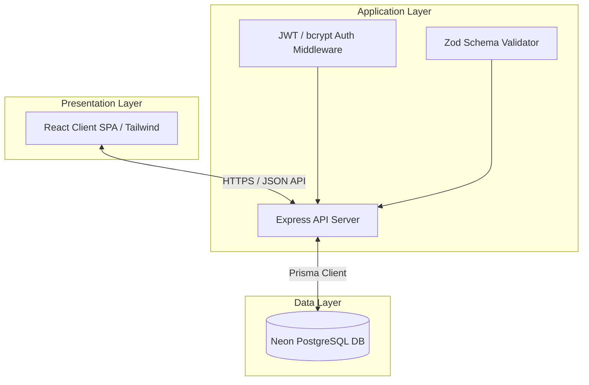
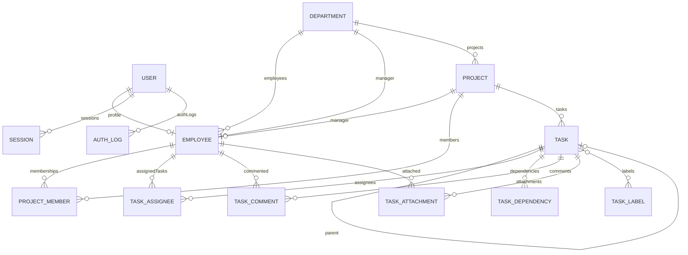

# 🎓 Technical Project Report: Task Management Portal
**Software Engineering Capstone / Internship Project Report**

**Prepared By:** Software Engineering Intern  
**Project Name:** Task Management Portal  
**Academic Target:** University Internship Evaluation  
**Date:** August 2026  

---

## 📄 Executive Summary

The **Task Management Portal** is a web-based project management system designed to coordinate collaborative workflows, assign tasks dynamically, track completion progress, and log audit trails. The system is engineered using a robust full-stack architecture comprising a **React.js** single-page application client, an asynchronous **Node.js/Express.js** REST API server, and a serverless **Neon PostgreSQL** database layer managed via **Prisma ORM**.

This report evaluates the lifecycle of the system, including requirement elicitation, architecture design, database normalization, security configuration, testing protocols, performance engineering, and reflective learning outcomes.

---

## 🎯 1. Introduction & Project Objectives

Collaborative project environments require reliable mechanisms to prevent task overlap, monitor deadlines, and audit user actions. This project builds a reliable, scalable task manager with these core objectives:
1.  **Workload Transparency**: Allow administrators to delegate tasks and monitor progress through analytical dashboards.
2.  **Access Security**: Guarantee data isolation through JSON Web Token (JWT) based authentication and role-based permissions.
3.  **Audit Integrity**: Implement immutable log trails documenting task transitions for organizational auditing.
4.  **Operational Performance**: Ensure sub-second page responses and database queries via pagination, indexing, and connection pooling.

---

## 📋 2. Requirement Analysis

### 2.1 Functional Requirements (FR)

The core functional capabilities of the system are categorized by role:

| Module | Requirement ID | Description | Authorized Roles |
| :--- | :--- | :--- | :--- |
| **Authentication** | FR-AUTH-01 | Users must register and log in securely using encrypted passwords. | Public |
| | FR-AUTH-02 | Session management must use secure, HTTP-only cookie-based JWT tokens. | Member, Admin |
| **Task Management**| FR-TASK-01 | Create, view, update, and delete (CRUD) tasks with title, description, priority, and status. | Member, Admin |
| | FR-TASK-02 | Filter tasks dynamically by category, status, priority, and string search keywords. | Member, Admin |
| | FR-TASK-03 | Assign tasks to specific registered users. | Admin Only |
| **Category Management** | FR-CAT-01 | Create custom categories to group tasks (e.g., Marketing, Engineering). | Admin Only |
| **Audit Logs** | FR-AUDIT-01 | Automatically generate immutable entries tracking task creation, updates, status changes, and assignments. | Admin Only |
| **Dashboard** | FR-DASH-01 | Render visual analytics of task completion states and team workload distribution. | Member, Admin |

### 2.2 Non-Functional Requirements (NFR)

The system enforces the following technical benchmarks:
*   **Security (NFR-SEC-01)**: Protection against OWASP Top 10 vulnerabilities (XSS, CSRF, SQL Injection, and Brute Force attacks).
*   **Scalability (NFR-SCA-01)**: Response time under 200ms for database read queries containing pagination.
*   **Usability (NFR-USA-01)**: Fully responsive design adapting to mobile, tablet, and desktop viewports using a modern glassmorphic Tailwind palette.
*   **Maintainability (NFR-MNT-01)**: Modular structure utilizing the Controller-Service-Repository separation pattern in the backend and custom hook abstractions in the frontend.

---

## 📐 3. System Architecture & Component Decomposition

The system implements a classic **Three-Tier Architecture** consisting of the Presentation Layer, the Application Logic Layer, and the Data Persistence Layer.

For a comprehensive review of the structural interactions, data flow, and components, consult the [docs/system-design.md](file:///c:/Resume%20Project/Task%20Management%20Portal/docs/system-design.md) system designer guide.

---

## 🗄️ 4. Relational Database Design

The database schema is designed to enforce relational integrity and third normal form (3NF). Data persistence is structured around the primary entities: `User`, `Employee`, `Department`, `Project`, `ProjectMember`, `Task`, `TaskAssignee`, `TaskDependency`, `TaskComment`, `TaskAttachment`, `TaskLabel`, `Session`, `AuthLog`, `Category`, and `ActivityLog`.

To support rapid read queries on filters, indexes are applied to the primary relation keys:
*   `assigneeId` and `categoryId` on `Task`
*   `employeeCode`, `email`, `status`, and `managerId` on `Employee`
*   `code`, `status`, `managerId`, and `createdAt` on `Department`
*   `code`, `status`, `priority`, `departmentId`, and `managerId` on `Project`
*   `projectId` and `employeeId` on `ProjectMember`
*   `taskCode`, `status`, `priority`, `projectId`, `parentTaskId`, and `reporterId` on `Task`
*   `taskId` and `employeeId` on `TaskAssignee` and `TaskComment`
*   `taskId` and `dependsOnTaskId` on `TaskDependency`

For the complete schema code and normalization breakdown, view the [docs/database-design.md](file:///c:/Resume%20Project/Task%20Management%20Portal/docs/database-design.md) document.

---

## 🏗️ 5. Technical Implementation Details

### 5.1 Frontend Client (React)
The client application is built as a single-page application using **React Router v6** to enforce public and private route constraints. Key highlights of the frontend design:
*   **Custom Axios Client Interceptor**: Intercepts outgoing requests to append in-memory access tokens and dynamically catches `401 Unauthorized` responses to execute silent refresh token rotations, retrying failed requests.
*   **Zustand Auth Store**: Client-side state manager handling authentication status, user profile details, loading spinners, and access tokens in memory.
*   **Zustand Employee Store**: Centralizes listing state, paginated indices, active query filters, selection lists, and download triggers for CSV reports.
*   **Zustand Department Store**: Manages directory state, pagination filters, bulk operation selected IDs, manager assignment, and workforce allocation arrays.
*   **Zustand Project Store**: Manages projects roster listing state, filter parameters, selection check buffers, timelines elapsed data, and members list.
*   **Zustand Task Store**: Manages tasks Kanban board, tabular listings, active filter selectors, comments array feed, and files attachments uploader.
*   **Recharts Data Visualization**: Implements responsive canvas-based charts mapping status distributions (Pie), priority groups (Doughnut), performance vectors (Area), and completion history (Line/Bar) with clean Tooltip hover states.
*   **Code Splitting & Suspense**: Utilizes `React.lazy()` dynamic page imports to split `Employees`, `EmployeeDetails`, `Departments`, `DepartmentDetails`, `Projects`, `ProjectDetails`, `Tasks`, and `TaskDetails` views into standalone bundles, reducing initial client-side footprint.
*   **Tailwind CSS UI**: Modern dark-theme styled components using glassmorphic cards, CSS flex grids, backdrop filters, and Framer Motion hover animations.

### 5.2 Backend API (Node.js/Express.js)
The backend is structured using the **Controller-Service-Repository** pattern to isolate routing, business validation, and database operations.
*   **Middleware Pipeline**: Incoming requests pass through Helmet (header security), CORS configurations, Express-rate-limiters, and Zod validator schemas before routing.
*   **Multer Static Uploader & Serving**: Serves avatar images and attachments locally, restricting file types and sizes.
*   **Repository Query Layer**: Decouples services from Prisma ORM, consolidating queries inside `EmployeeRepository`, `DepartmentRepository`, `ProjectRepository`, and `TaskRepository` classes.
*   **Database Transactions**: Enforces manager/employee mappings, project members, assignees, and task blockers dependencies using transaction blocks (`prisma.$transaction`) to keep relational links synchronized.
*   **Dual-Token Handshake**: Implements validation of stateless short-lived access tokens via authorization headers and session-rotated refresh tokens via HttpOnly cookies.
*   **Dashboard Aggregates Service**: Exposes metrics endpoints returning role-filtered statistics cards, active notification alerts, activity logs, and charting datasets. The services utilize mock adapters in early development to decouple database dependencies.

For directories, structural diagrams, and source code patterns, see the [docs/architecture-guide.md](file:///c:/Resume%20Project/Task%20Management%20Portal/docs/architecture-guide.md) architectural guide.

---

## 🛡️ 6. Security & Authentication Model

Security configuration is designed around OWASP compliance guidelines. The application uses a multi-layered security plan:
1.  **Authentication**: Passwords are saved as irreversible hashes using `bcrypt` with a work factor of 12 rounds.
2.  **Authorization (RBAC)**: Custom Express middleware verifies role scopes (`ADMIN`, `MANAGER`, or `EMPLOYEE`) before routing.
3.  **Session Security**: Active logins are stored in a dedicated `Session` database table, enabling refresh token rotation, device tracking, and logout revocation.
4.  **Data Protection**:
    *   **SQL Injection**: Prevented globally by utilizing Prisma ORM's parameterized query engines.
    *   **Cross-Site Scripting (XSS)**: Handled by storing refresh tokens in secure HttpOnly cookies, keeping access tokens in memory, and using Helmet CSP headers.

Read more in the detailed [docs/security-auth.md](file:///c:/Resume%20Project/Task%20Management%20Portal/docs/security-auth.md) security evaluation.

---

## 🧪 7. Verification & Performance Optimization

To ensure production stability, the application was validated under simulated network environments and high data volume testing:
*   **API Verification**: Automated validation checks written inside Postman collections verifying responses against schema outputs.
*   **Query Pagination**: Implementation of offset and cursor pagination to avoid performance bottleneck during large-scale listing requests.
*   **Frontend Performance**: Code splitting via `React.lazy` and lazy loading of components outside the viewport to minimize bundle sizes.

Refer to [docs/testing-performance.md](file:///c:/Resume%20Project/Task%20Management%20Portal/docs/testing-performance.md) for full benchmarks and scripting schemas.

---

## 🔔 8. Notifications & Activity Logging System

The system integrates a real-time, non-blocking notification delivery engine and a persistent audit log tracker:
1. **Asynchronous Non-Blocking Execution**: To prevent database logging operations from delaying business critical actions (such as updating task status or creating project entries), notification and logging queries are executed in isolated, fail-safe try-catch scopes.
2. **Context Storage Hook (`AsyncLocalStorage`)**: Express middleware resolves request-level parameters (IP Address, User Agent, active user ID) and persists them inside node's `AsyncLocalStorage`. The logging layer extracts these attributes automatically.
3. **Fine-grained RBAC and Department Scoping**: Audit log lookups are scoped by user role. Admins see all logs, managers see only logs relating to employees within their department, and employees are restricted to their own actions.

For detailed sequence diagrams and database design documentation, consult [docs/notifications-activities.md](file:///c:/Resume%20Project/Task%20Management%20Portal/docs/notifications-activities.md).

---

## 📈 9. Analytics & Reporting Module (Phase 9)

Phase 9 implements an enterprise-grade analytics dashboard and document generator built on server-side aggregates and caching:
1.  **High-Performance Aggregations**: The system computes statistics directly on Neon PostgreSQL using native Prisma ORM aggregates (`_avg`, `count`) rather than reading heavy records.
2.  **Transient Cache Abstraction**: Caches expensive database counts for 60 seconds using a transient Cache Service Map. This isolates the caching boundaries so Redis can be swapped in later without code changes.
3.  **Role-Based Scope Guards**: Ensures strict data boundaries before query execution. Admins see full cross-department stats, managers see only their department's data, and employees are limited to personal productivity metrics.
4.  **Decoupled Document Exporter**: Implements a unified formatting pipeline. Features on-the-fly CSV, XLSX (using SheetJS), and PDF (using PDFKit) generators returned directly as streamed downloads.

---

## 📅 10. Calendar, Scheduling & Leave Management Module (Phase 10)

Phase 10 implements a complete Calendar and Leaves approval workflows engine:
1.  **Unified Events Merging Feed**: The calendar feed aggregates events dynamically from `CalendarEvent`, `Holiday`, `Task` (due dates), and `Project` (milestones) tables, compiling them on-the-fly into a single unified JSON model shape.
2.  **Date Overlaps Verification**: Validates requests before creation to prevent overlapping approved leaves for the same employee.
3.  **Lazy Recurring Events Engine**: Supports DAILY, WEEKLY, MONTHLY, and YEARLY recurrences, lazily pre-generating future occurrence items up to 3 months ahead by default.
4.  **Draggable Event DB Updates**: Coordinates drag-and-drop actions. When task due dates or project milestones are dragged, backend updates update the original task and project records in the database.

---

## ⏰ 11. Attendance, Timesheet & Productivity Tracking Module (Phase 11)

Phase 11 implements a complete Attendance tracking and Timesheets compilation engine:
1.  **Chronological Work Sessions**: Maps daily attendance logs to granular `WorkSession` segments (storing both check-in/out working hours and break durations).
2.  **Productivity Recalculator**: Automatically computes total daily working hours, break durations, average monthly check-in/out timestamps, and daily overtime (`Working Hours - 8`).
3.  **Approved Leave Automation**: Detects approved leaves dynamically, automatically marking daily logs as `LEAVE` when no work session is recorded.
4.  **Correction Queue Workflow**: Enables manual override submissions. Upon approval, existing work sessions are replaced, and daily aggregates are recalculated dynamically.
5.  **Audit Logs & Notifications**: Triggers audit logs and push notification messages on approvals.

---

## 🚀 12. Deployment Strategies

The system utilizes a fully automated, cloud-based Continuous Integration and Deployment (CI/CD) setup:
*   **Frontend Client**: Hosted on **Vercel** with custom rewrite configurations to route SPA links safely to index.html.
*   **Backend Client**: Hosted on **Render Web Services** using automatic git hooks and environment configurations.
*   **Database Persistent Instance**: Provisioned on **Neon Serverless PostgreSQL** database.

Refer to [docs/installation-deployment.md](file:///c:/Resume%20Project/Task%20Management%20Portal/docs/installation-deployment.md) for step-by-step local commands and cloud provisioning checklists.

---

## 📊 13. Challenges, Retrospective & Lessons Learned

### 13.1 Technical Challenges & Mitigations
*   **Asynchronous Database Bottlenecks**: High concurrent requests to foreign keys led to performance drops. Mitigation involved introducing pooled connections and indexing relationships.
*   **Stateless Token Expiry UX**: Standard token lifespans disrupted user sessions mid-use. Resolved by using client-side Axios refresh interceptors to extend sessions silently.

### 13.2 Engineering Learning Outcomes
The implementation of the Task Management Portal provided hands-on experience in:
*   Relational database normalizations and performance indexing.
*   Building security middleware stacks in Express.js.
*   Managing component trees and side-effects within React.js.

For a post-mortem review and a roadmap of **15+ future product enhancements**, consult the [docs/post-mortem.md](file:///c:/Resume%20Project/Task%20Management%20Portal/docs/post-mortem.md) document.
