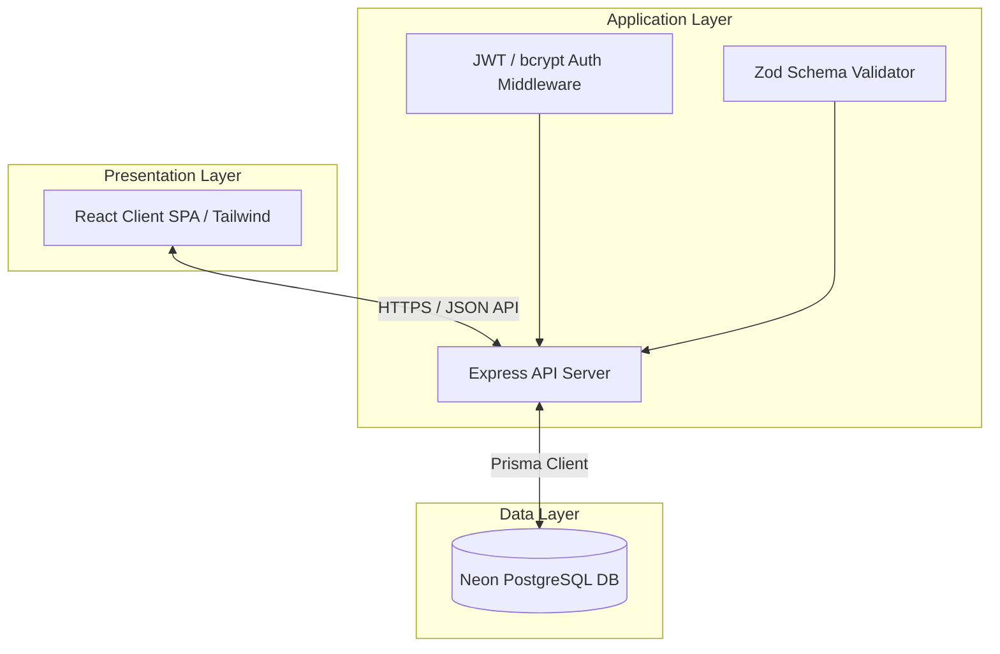
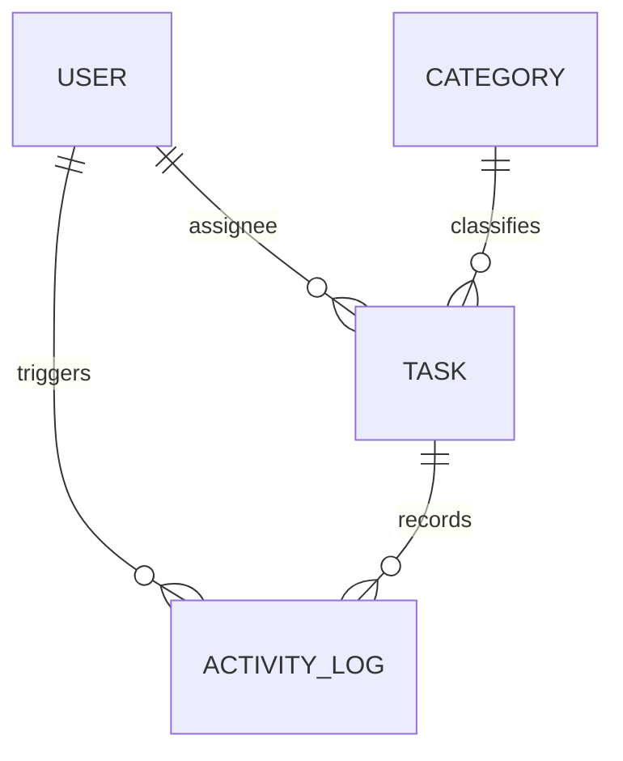

# 🎓 Technical Project Report: Task Management Portal
**Software Engineering Capstone / Internship Project Report**

**Prepared By:** Software Engineering Intern  
**Project Name:** Task Management Portal  
**Academic Target:** University Internship Evaluation  
**Date:** August 2026  

---

## 📄 Executive Summary

The **Task Management Portal** is a web-based project management system designed to coordinate collaborative workflows, assign tasks dynamically, track completion progress, and log audit trails. The system is engineered using a robust full-stack architecture comprising a **React.js** single-page application client, an asynchronous **Node.js/Express.js** REST API server, and a serverless **Neon PostgreSQL** database layer managed via **Prisma ORM**.

This report evaluates the lifecycle of the system, including requirement elicitation, architecture design, database normalization, security configuration, testing protocols, performance engineering, and reflective learning outcomes.

---

## 🎯 1. Introduction & Project Objectives

Collaborative project environments require reliable mechanisms to prevent task overlap, monitor deadlines, and audit user actions. This project builds a reliable, scalable task manager with these core objectives:
1.  **Workload Transparency**: Allow administrators to delegate tasks and monitor progress through analytical dashboards.
2.  **Access Security**: Guarantee data isolation through JSON Web Token (JWT) based authentication and role-based permissions.
3.  **Audit Integrity**: Implement immutable log trails documenting task transitions for organizational auditing.
4.  **Operational Performance**: Ensure sub-second page responses and database queries via pagination, indexing, and connection pooling.

---

## 📋 2. Requirement Analysis

### 2.1 Functional Requirements (FR)

The core functional capabilities of the system are categorized by role:

| Module | Requirement ID | Description | Authorized Roles |
| :--- | :--- | :--- | :--- |
| **Authentication** | FR-AUTH-01 | Users must register and log in securely using encrypted passwords. | Public |
| | FR-AUTH-02 | Session management must use secure, HTTP-only cookie-based JWT tokens. | Member, Admin |
| **Task Management**| FR-TASK-01 | Create, view, update, and delete (CRUD) tasks with title, description, priority, and status. | Member, Admin |
| | FR-TASK-02 | Filter tasks dynamically by category, status, priority, and string search keywords. | Member, Admin |
| | FR-TASK-03 | Assign tasks to specific registered users. | Admin Only |
| **Category Management** | FR-CAT-01 | Create custom categories to group tasks (e.g., Marketing, Engineering). | Admin Only |
| **Audit Logs** | FR-AUDIT-01 | Automatically generate immutable entries tracking task creation, updates, status changes, and assignments. | Admin Only |
| **Dashboard** | FR-DASH-01 | Render visual analytics of task completion states and team workload distribution. | Member, Admin |

### 2.2 Non-Functional Requirements (NFR)

The system enforces the following technical benchmarks:
*   **Security (NFR-SEC-01)**: Protection against OWASP Top 10 vulnerabilities (XSS, CSRF, SQL Injection, and Brute Force attacks).
*   **Scalability (NFR-SCA-01)**: Response time under 200ms for database read queries containing pagination.
*   **Usability (NFR-USA-01)**: Fully responsive design adapting to mobile, tablet, and desktop viewports using a modern glassmorphic Tailwind palette.
*   **Maintainability (NFR-MNT-01)**: Modular structure utilizing the Controller-Service-Repository separation pattern in the backend and custom hook abstractions in the frontend.

---

## 📐 3. System Architecture & Component Decomposition

The system implements a classic **Three-Tier Architecture** consisting of the Presentation Layer, the Application Logic Layer, and the Data Persistence Layer.

For a comprehensive review of the structural interactions, data flow, and components, consult the [docs/system-design.md](file:///c:/Resume%20Project/Task%20Management%20Portal/docs/system-design.md) system designer guide.

---

## 🗄️ 4. Relational Database Design

The database schema is designed to enforce relational integrity and third normal form (3NF). Data persistence is structured around four primary entities: `User`, `Task`, `Category`, and `ActivityLog`.

To support rapid read queries on filters, standard composite indexes are applied to `(status, priority)` and foreign keys:
*   `assigneeId` on `Task`
*   `categoryId` on `Task`

For the complete schema code and normalization breakdown, view the [docs/database-design.md](file:///c:/Resume%20Project/Task%20Management%20Portal/docs/database-design.md) document.

---

## 🏗️ 5. Technical Implementation Details

### 5.1 Frontend Client (React)
The client application is built as a single-page application using **React Router v6** to enforce public and private route constraints. Key highlights of the frontend design:
*   **Custom Axios Hook**: Intercepts outgoing requests to append authentication headers and dynamically catches `401 Unauthorized` responses to clear invalid sessions.
*   **Context API for Authentication State**: Centralized auth provider managing global user state, loading animations, and session recovery on boot.
*   **Tailwind UI**: Modern CSS styling utilizing CSS grid, flex layouts, transition animations, and dark-theme aesthetics.

### 5.2 Backend API (Node.js/Express.js)
The backend is structured using the **Controller-Service-Repository** pattern to isolate routing, business logic, and database operations.
*   **Middleware Pipeline**: Incoming requests pass through Helmet (header security), CORS configurations, Express-rate-limiters, and Zod parser validators before executing the controller.
*   **JWT Handshake**: Implements validation of stateless tokens signed using a 256-bit asymmetric signature.

For directories, structural diagrams, and source code patterns, see the [docs/architecture-guide.md](file:///c:/Resume%20Project/Task%20Management%20Portal/docs/architecture-guide.md) architectural guide.

---

## 🛡️ 6. Security & Authentication Model

Security configuration is designed around OWASP compliance guidelines. The application uses a multi-layered security plan:
1.  **Authentication**: Passwords are saved as irreversible hashes using `bcrypt` with a work factor of 12 rounds.
2.  **Authorization**: Custom Express middleware verifies roles (`Admin` or `Member`) before controller routing.
3.  **Data Protection**:
    *   **SQL Injection**: Prevented globally by utilizing Prisma ORM's parameterized query engines.
    *   **Cross-Site Scripting (XSS)**: Handled by sanitizing inputs and using Helmet headers (`Content-Security-Policy`, `X-XSS-Protection`).
    *   **Cross-Origin Requests**: Restricting access domains via configurable CORS options.

Read more in the detailed [docs/security-auth.md](file:///c:/Resume%20Project/Task%20Management%20Portal/docs/security-auth.md) security evaluation.

---

## 🧪 7. Verification & Performance Optimization

To ensure production stability, the application was validated under simulated network environments and high data volume testing:
*   **API Verification**: Automated validation checks written inside Postman collections verifying responses against schema outputs.
*   **Query Pagination**: Implementation of offset and cursor pagination to avoid performance bottleneck during large-scale listing requests.
*   **Frontend Performance**: Code splitting via `React.lazy` and lazy loading of components outside the viewport to minimize bundle sizes.

Refer to [docs/testing-performance.md](file:///c:/Resume%20Project/Task%20Management%20Portal/docs/testing-performance.md) for full benchmarks and scripting schemas.

---

## 🚀 8. Deployment Strategies

The system utilizes a fully automated, cloud-based Continuous Integration and Deployment (CI/CD) setup:
*   **Frontend Client**: Hosted on **Vercel** with custom rewrite configurations to route SPA links safely to index.html.
*   **Backend Client**: Hosted on **Render Web Services** using automatic git hooks and environment configurations.
*   **Database Persistent Instance**: Provisioned on **Neon Serverless PostgreSQL** database.

Refer to [docs/installation-deployment.md](file:///c:/Resume%20Project/Task%20Management%20Portal/docs/installation-deployment.md) for step-by-step local commands and cloud provisioning checklists.

---

## 📊 9. Challenges, Retrospective & Lessons Learned

### 9.1 Technical Challenges & Mitigations
*   **Asynchronous Database Bottlenecks**: High concurrent requests to foreign keys led to performance drops. Mitigation involved introducing pooled connections and indexing relationships.
*   **Stateless Token Expiry UX**: Standard token lifespans disrupted user sessions mid-use. Resolved by using client-side Axios refresh interceptors to extend sessions silently.

### 9.2 Engineering Learning Outcomes
The implementation of the Task Management Portal provided hands-on experience in:
*   Relational database normalizations and performance indexing.
*   Building security middleware stacks in Express.js.
*   Managing component trees and side-effects within React.js.

For a post-mortem review and a roadmap of **15+ future product enhancements**, consult the [docs/post-mortem.md](file:///c:/Resume%20Project/Task%20Management%20Portal/docs/post-mortem.md) document.
