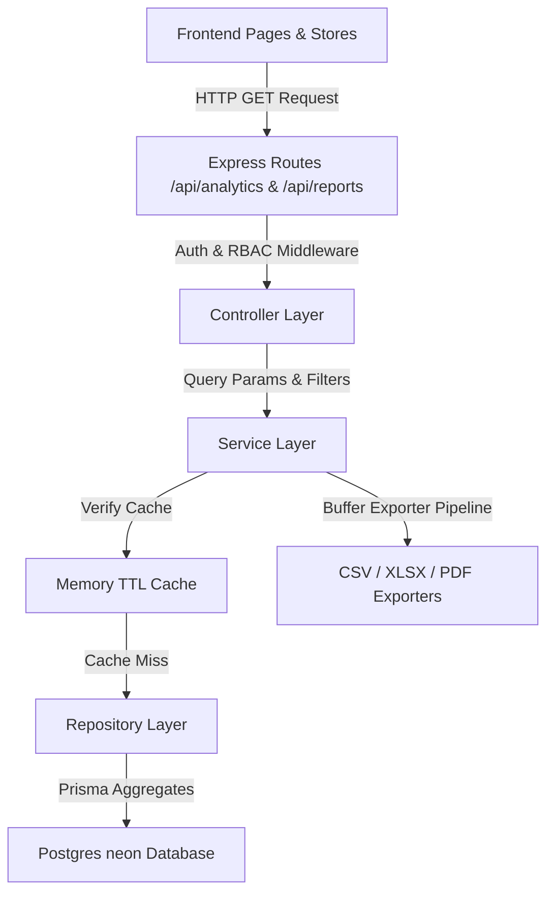

# 📈 Analytics & Reporting System Documentation

This guide provides technical specs, designs, and architectural patterns of Phase 9.

---

## 🏗️ 1. Architecture Flow
The module conforms strictly to the Controller-Service-Repository pattern.

---

## 📐 2. Server-Side Aggregations & Calculations

To achieve sub-second query performance on transactional tables, all calculations are executed directly on Neon PostgreSQL using aggregate functions:

1.  **Average Project Progress**:
    Calculated via `prisma.project.aggregate({ _avg: { progress: true }, where })`. Returns the average completion percentage across all projects in scope.
2.  **Average Task Completion**:
    Calculated via `prisma.task.aggregate({ _avg: { completionPercentage: true }, where })`.
3.  **Task Status Dividers**:
    Divided into:
    *   **Completed**: `status === 'COMPLETED'`
    *   **Blocked**: `status === 'BLOCKED'`
    *   **Pending**: `status IN ('TODO', 'IN_PROGRESS', 'IN_REVIEW')`
    *   **Overdue**: `status NOT IN ('COMPLETED', 'CANCELLED')` AND `dueDate < NOW`
4.  **Productivity Trends**:
    Identified via `Task.updatedAt` for tasks with `status === 'COMPLETED'`. This keeps calculations isolated so they can be easily replaced by a dedicated `completedAt` timestamp in the future.

---

## 🔒 3. Role-Based Access Control (RBAC) Data Boundaries

Data scopes are resolved securely in the backend services (`buildRbacWhere`) BEFORE querying database counts or generating document reports:

*   **ADMIN**: No limits. Can filter records across any department, project, employee, or status.
*   **MANAGER**: Limited to their department scope:
    *   Employees: returns employees within their department.
    *   Projects: returns projects belonging to their department.
    *   Tasks: returns tasks of projects belonging to their department.
*   **EMPLOYEE**: Limited strictly to their assigned records:
    *   Employees: returns their own record.
    *   Projects: returns projects where they are members.
    *   Tasks: returns tasks assigned to them.

---

## ⚡ 4. Caching & Performance Optimizations

1.  **Cache Service Abstraction**:
    Uses a transient in-memory map wrapper in `CacheService` to cache expensive analytics counts for 60 seconds. The cache key is generated using:
    `const cacheKey = 'analytics_overview_' + userId + '_' + JSON.stringify(filters);`
    The wrapper allows swapping to Redis in the future without modifying any business logic.
2.  **Debounced Filters**:
    Debounces text inputs and filters on the client to avoid sending redundant network requests.
3.  **Lazy Loading**:
    Lazy-loads `Analytics` and `Reports` components to reduce initial page weight.

---

## 📥 5. Document Exporter Pipeline

Supports generating dynamic files on the server side:

*   **CSV**: Built using comma-delimited strings with double-quote escaping.
*   **XLSX**: Compiled using the `xlsx` library to serialize worksheets directly into binary buffers.
*   **PDF**: Designed landscape pages with `pdfkit` mapping table rows, page index headers, and borders.
