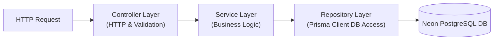

# 🏗️ Codebase Architecture Guide
**Task Management Portal Directory Layout & Design Patterns**

---

## 📂 1. Directory Structure

The repository is structured as a monorepo containing decoupled directories for the client SPA and the API server, ensuring separate development environments.

```
/task-management-portal
│
├── frontend/                     # React Client SPA
│   ├── public/                   # Static browser assets
│   ├── src/
│   │   ├── assets/               # CSS global styles, local media assets
│   │   ├── components/           # Reusable presentational components
│   │   │   ├── common/           # Button, Input, Modal, Loader
│   │   │   ├── dashboard/        # Analytics charts, summaries
│   │   │   └── tasks/            # TaskCard, TaskBoard, TaskForm
│   │   ├── context/              # Context API Providers
│   │   │   └── AuthContext.jsx   # Authentication State Provider
│   │   ├── hooks/                # Modular Custom React hooks
│   │   │   └── useAxios.js       # Secured network client hook
│   │   ├── pages/                # Route level entry layouts
│   │   │   ├── Login.jsx         # Access portal page
│   │   │   ├── Dashboard.jsx     # Overview board
│   │   │   └── ManageTasks.jsx   # Admin task coordinator list
│   │   ├── routes/               # Navigation routers & guards
│   │   │   └── PrivateRoute.jsx  # Authorization role controller
│   │   ├── services/             # Endpoint connection layers (Axios)
│   │   ├── App.jsx               # Client initialization
│   │   └── main.jsx              # React DOM mounting
│   ├── package.json
│   └── tailwind.config.js        # Design tokens
│
└── backend/                      # Node.js Express REST API
    ├── prisma/
    │   ├── migrations/           # Autogenerated DB migration tracking
    │   └── schema.prisma         # Database schemas
    ├── src/
    │   ├── config/               # Database, server, and environmental configs
    │   ├── controllers/          # API Handlers (Request parsing & routing status)
    │   ├── middlewares/          # Validation, Auth status checking
    │   │   ├── auth.middleware.js # JWT verification filter
    │   │   └── error.middleware.js # Central error responder
    │   ├── services/             # Core Business services
    │   ├── repositories/         # DB interfaces (Prisma client operations)
    │   ├── routes/               # Express Router routes mapping
    │   ├── utils/                # Password helpers, string parsers
    │   └── app.js                # App server orchestration
    ├── .env.example
    ├── package.json
    └── README.md
```

---

## 🏗️ 2. Architectural Design Patterns

To maintain a clean codebase as it scales, the project implements several key design patterns:

### 2.1 Controller-Service-Repository Pattern (Backend)
The backend architecture separates routing, business validation, and direct database access:



*   **Controller Layer**: Inspects incoming HTTP payloads, extracts routing params, triggers Zod validation checks, and sends matching HTTP codes.
*   **Service Layer**: Represents the transactional domain logic. Orchestrates calls to repositories and formats data structures (e.g. calculating priority points or trigger logs).
*   **Repository Layer (Prisma ORM)**: Executes direct database reads, writes, joins, and indexing structures.

### 2.2 Client-Side Zustand Authentication Store (Frontend)
The React client utilizes the **Zustand Store** pattern. Global authentication states, access tokens, loading markers, and API triggers are centralized inside a unified store (`authStore.js`). This allows components to inspect user details or trigger login handshakes reactively without wrapping page roots in Context Providers.

---

## 💻 3. Key Architectural Abstractions (Code Snippets)

### 3.1 Frontend: Custom Axios API Client with Rotation Interceptor
Centralized Axios instance dynamically appending in-memory JWT access tokens and intercepting status 401 to execute silent refresh token rotations.

```javascript
// src/api/apiClient.js
import axios from 'axios';
import { useAuthStore } from '../store/authStore';

const API_URL = import.meta.env.VITE_API_URL || 'http://localhost:5000/api';

export const apiClient = axios.create({
  baseURL: API_URL,
  withCredentials: true
});

apiClient.interceptors.request.use((config) => {
  const { accessToken } = useAuthStore.getState();
  if (accessToken) {
    config.headers.Authorization = `Bearer ${accessToken}`;
  }
  return config;
});
```

### 3.2 Backend: Decoupled Controller-Service Routing Implementation
Implementation pattern verifying separation of concerns between HTTP layers and domain logic.

```javascript
// src/controllers/task.controller.js
import { TaskService } from '../services/task.service.js';
import { taskSchema } from '../utils/validators.js';

export const createTaskController = async (req, res, next) => {
  try {
    // Validate request body using schemas
    const parsedData = taskSchema.parse(req.body);
    
    // Inject actor information verified from Auth middleware
    const creatorId = req.user.id;
    
    // Delegate processing logic to Service Layer
    const newTask = await TaskService.createTask(parsedData, creatorId);
    
    return res.status(201).json({
      success: true,
      message: "Task created successfully.",
      data: newTask
    });
  } catch (error) {
    next(error); // Route to global Express error middleware
  }
};
```

```javascript
// src/services/task.service.js
import { prisma } from '../config/db.js';

export class TaskService {
  static async createTask(data, creatorId) {
    // Database Operations are wrapped inside a safe transaction
    return await prisma.$transaction(async (tx) => {
      const task = await tx.task.create({
        data: {
          title: data.title,
          description: data.description,
          priority: data.priority,
          dueDate: new Date(data.dueDate),
          categoryId: data.categoryId,
          assigneeId: data.assigneeId,
          creatorId: creatorId,
        }
      });

      // Write Audit Log entry
      await tx.activityLog.create({
        data: {
          action: 'TASK_CREATED',
          details: `Task '${task.title}' was created and assigned.`,
          userId: creatorId,
          taskId: task.id
        }
      });

      return task;
    });
  }
}
```

## 📊 4. Dashboard Foundation & Integration Points

The Dashboard Module is built on a decoupled architecture, separating visual representations from the business database models. This foundation provides structural contracts that will seamlessly hook into future tables as they are implemented.

### 4.1 Component Hierarchy (Frontend)
The frontend utilizes a modular grid format composed of generic, decoupled visual cards:
```
Dashboard (page)
│
├── DashboardHeader (receives onSearch callback, handles debounce)
│
├── StatsCard (metrics representation, animated by framer-motion)
│
├── QuickActions (role-filtered button navigations)
│
├── ChartCard (generic wrappers injecting Recharts)
│   ├── Pie / Doughnut Chart
│   └── Bar / Line / Area Chart
│
├── ActivityCard (displays activity logs list)
│
└── NotificationCard (displays user alert logs list)
```

### 4.2 Data Flows
1.  **Auth Boot**: The route guard `ProtectedRoute` verifies session credentials.
2.  **Parallel Load**: React triggers parallel API fetches (`overview`, `activity`, `notifications`, `charts`) via `apiClient`.
3.  **Role Filter**: The server filters the response payload according to `req.user.role`.
4.  **State Render**: Zustand updates active state records, feeding responsive charting configurations.

### 4.3 Future Integration Roadmap
When the business modules are fully developed in later phases, the dashboard foundation integrates without refactoring:
*   **Prisma Aggregations**: The service layer `dashboard.service.js` will replace mock arrays with direct queries:
    *   *Overview stats*: `prisma.task.count({ where: { status: 'TODO' } })`.
    *   *Departments stats*: `prisma.department.count()`.
    *   *User assignments*: Filtering queries using relations: `prisma.task.findMany({ where: { assigneeId: userId } })`.
*   **Activity Logs**: Read records from the unified `ActivityLog` relational table.

## 👥 5. Employee Management Architecture & Repository Pattern

The Employee Module introduces an enterprise-grade architecture separating routing, payload validation, business rules, storage wrappers, and database queries.

### 5.1 Repository Pattern Implementation (Backend)
To decouple database operations from business logic and Prisma Client schemas, the repository layer `employee.repository.js` encapsulates all SQL-level transactions.
```javascript
// src/repositories/employee.repository.js
export class EmployeeRepository {
  static async findAndCount({ where, skip, take, orderBy }) {
    const [employees, total] = await Promise.all([
      prisma.employee.findMany({ where, skip, take, orderBy }),
      prisma.employee.count({ where })
    ]);
    return { employees, total };
  }
}
```

### 5.2 Storage Service Abstraction & Multer
Avatars are handled via a local disk storage layout using Multer. The controller calls a unified `StorageService` interface, isolating future migrations to Cloudinary or AWS S3:
```
[Multer Middleware] -> [StorageService.saveFile(file)] -> Returns Public URL Path
                                                      -> Deletes orphaned file on updates
```

### 5.3 Frontend Component Hierarchy
The employee listings page is designed using a declarative sub-component hierarchy:
```
Employees (page)
│
├── EmployeeFilters (handles search key debounce, dropdown tags, bulk edits, exports)
│
├── EmployeeTable (presents avatar grids, select list rows, and inline CRUD links)
│   └── Multi-select Selection Banner (ADMIN only toolbar)
│
└── EmployeePagination (footer offset navigator page controls)
```

## 🏢 6. Department Management Architecture & Workflows

The Department Module expands the system design by incorporating multi-relational database transaction scopes.

### 6.1 Transaction-Safe Assignments Repository (Backend)
To map manager assignments securely, a database `$transaction` block handles clearing existing assignments and mapping new linkages:
```javascript
// src/repositories/department.repository.js
static async assignManager(id, managerId, updatedById) {
  return prisma.$transaction(async (tx) => {
    // Enforce ONE department managed at a time
    if (managerId) {
      await tx.department.updateMany({
        where: { managerId, id: { not: id }, isDeleted: false },
        data: { managerId: null }
      });
    }
    // Update target department manager
    const department = await tx.department.update({
      where: { id },
      data: { managerId, updatedById }
    });
    // Ensure manager's department ID is updated
    if (managerId) {
      await tx.employee.update({
        where: { id: managerId },
        data: { departmentId: id }
      });
    }
    return department;
  });
}
```

### 6.2 Frontend Page & Modal Architecture
The layout incorporates code-split page views and modals:
```
Departments (page)
│
├── DepartmentToolbar (coordinates search input and action triggers)
│
├── DepartmentStatistics (renders global metrics aggregate panels)
│
├── BulkActionToolbar (actions selector for status/delete operations)
│
└── DepartmentTable (registers items grid)
```

Inside the Department Details view, sub-modals handle assignments:
*   `ManagerAssignmentModal`: Renders active employees select list, updating manager ID configurations.
*   `EmployeeAssignmentModal`: Renders checklist grids, linking multiple employees to the department in a single patch call.

## 📂 7. Project Management Architecture & Workflows

The Project Module utilizes many-to-many database structures using the `ProjectMember` join model.

### 7.1 Transactional Member Allocation Repository (Backend)
To assign project members safely, a transaction block deletes previous allocations and bulk inserts new ones after validating project state and employee profiles:
```javascript
// src/repositories/project.repository.js
static async assignMembers(id, members, updatedById) {
  return prisma.$transaction(async (tx) => {
    // 1. Verify project state
    const project = await tx.project.findUnique({ where: { id } });
    if (!project || project.isDeleted || project.status === 'CANCELLED') {
      throw new Error('Project invalid or cannot receive new members.');
    }
    // 2. Validate employee existence
    const employeeIds = members.map(m => m.employeeId);
    const count = await tx.employee.count({ where: { id: { in: employeeIds }, isDeleted: false } });
    if (count !== employeeIds.length) {
      throw new Error('One or more selected employees are invalid.');
    }
    // 3. Sync join memberships
    await tx.projectMember.deleteMany({ where: { projectId: id } });
    await tx.projectMember.createMany({
      data: members.map(m => ({ projectId: id, employeeId: m.employeeId, role: m.role }))
    });
    return await tx.project.update({ where: { id }, data: { updatedById } });
  });
}
```

### 7.2 Frontend Page & Modal Architecture
The layout incorporates code-split directory pages:
```
Projects (page)
│
├── ProjectToolbar (coordinates search input and action triggers)
│
├── ProjectStatistics (renders overall metrics aggregate cards)
│
└── ProjectTable (registers projects and links)
```

Inside the Project Details view:
*   `TimelineCard`: Calculates start and target dates, elapsed duration, and days remaining.
*   `ManagerAssignmentModal`: Renders employees selector dropdowns, assigning project manager.
*   `MemberAssignmentModal`: Renders checkboxes list with dropdown role allocations (`TEAM_LEAD`, `DEVELOPER`, `TESTER`, etc.) to map project members in a transaction.

## 📂 8. Task Management Architecture & Workflows

The Task Module supports parent/subtask self-relational structures, drag-and-drop status workflows, blocker dependencies, comment discussions, and local attachments uploads.

### 8.1 Parent/Hierarchy Circular Check
To prevent self-parenting loops where task A is set as subtask of itself or one of its descendants, a recursive check queries up the parent chain:
```javascript
// src/services/task.service.js
static async checkCircularParent(taskId, parentTaskId) {
  if (!parentTaskId) return false;
  if (taskId === parentTaskId) return true;

  let currentParentId = parentTaskId;
  while (currentParentId) {
    if (currentParentId === taskId) {
      return true;
    }
    const parent = await prisma.task.findUnique({
      where: { id: currentParentId },
      select: { parentTaskId: true }
    });
    currentParentId = parent ? parent.parentTaskId : null;
  }
  return false;
}
```

### 8.2 Dependency Cycle Check (BFS)
Before adding a dependency blocker from Task A ➔ Task B, a Breadth-First Search (BFS) validates that B does not already directly or transitively depend on A:
```javascript
// src/services/task.service.js
static async checkCircularDependency(taskId, dependsOnTaskId) {
  if (taskId === dependsOnTaskId) return true;

  const visited = new Set();
  const queue = [dependsOnTaskId];

  while (queue.length > 0) {
    const currentId = queue.shift();
    if (currentId === taskId) {
      return true;
    }

    if (!visited.has(currentId)) {
      visited.add(currentId);
      const deps = await prisma.taskDependency.findMany({
        where: { taskId: currentId },
        select: { dependsOnTaskId: true }
      });
      for (const d of deps) {
        queue.push(d.dependsOnTaskId);
      }
    }
  }
  return false;
}
```

### 8.3 Status Transition Workflow
Status modifications pass through validation checking to enforce progress mappings:
*   `TODO` status automatically resets `completionPercentage` to `0%`.
*   `COMPLETED` status automatically sets `completionPercentage` to `100%`.
*   `CANCELLED` status represents a terminal state (cannot accept new assignees).
*   Valid state jumps:
    *   `TODO` ➔ `IN_PROGRESS` or `BLOCKED`
    *   `IN_PROGRESS` ➔ `IN_REVIEW` or `BLOCKED`
    *   `IN_REVIEW` ➔ `COMPLETED` or `IN_PROGRESS` or `TODO`
    *   `BLOCKED` ➔ `IN_PROGRESS`
    *   `COMPLETED` ➔ `IN_PROGRESS`

### 8.4 Kanban Board & HTML5 Drag and Drop
The board coordinates five columns mapping `TODO`, `IN_PROGRESS`, `IN_REVIEW`, `BLOCKED`, and `COMPLETED`:
*   `onDragStart` captures the dragged card's `taskId` payload.
*   `onDrop` triggers a `PATCH` request to `/api/tasks/:id/status` passing the target column status. If the service transition checks fail, the card resets to its source column.

---

## 🏢 9. Analytics & Reporting Architecture (Phase 9)

Phase 9 implements high-performance server-side aggregates, cache layers, and reporting pipelines:

### 9.1 Cache Abstraction Layer
A transient cache abstraction layer is implemented in `CacheService` (`backend/src/utils/cache.js`). The query caching decorator wraps database lookups with a serialized parameters key (`analytics_overview_userId_filters`) and a default TTL of 60 seconds. This prevents server overhead from multiple clicks on the client and is easily swappable with a Redis store in production.

### 9.2 Unified Document Export Pipeline
The report generator uses a single exporter pipeline (`formatExport` inside `ReportService`) which accepts structured column headers and array matrix values to serialize:
*   **CSV**: Built using string-delimiter maps.
*   **XLSX (SheetJS)**: Compiles workbook and worksheet buffers.
*   **PDF (PDFKit)**: Dynamically designs custom landscape pages with table alignments, border cells, and page layouts.

### 9.3 Client Visualizations (Recharts)
The frontend uses code-split pages (`Analytics.jsx`, `Reports.jsx`) loaded lazily. Interactive visual charts map:
*   `TrendChart`: Area charts detailing completion trends.
*   `PieChartCard`: Doughnut charts mapping task categories.
*   `BarChartCard`: Bar charts for team productivity rank.

---

## 📅 10. Calendar & Leave Management Architecture (Phase 10)

Phase 10 designs a unified calendar event aggregator and employee leaves approval workflows:

### 10.1 Unified Event Compilation Feed
The `CalendarService` aggregates records dynamically from multiple database tables (`CalendarEvent`, `Holiday`, `Task`, and `Project`) and formats them into a single, cohesive shape before returning them. This prevents duplication and avoids loading separate lists into frontend components.

### 10.2 Lazy Recurrent Scheduler
The recurrence rules (Daily, Weekly, Monthly, Yearly) are processed on-the-fly inside the service. New occurrences are batch-inserted into the `CalendarEvent` table with a max 3 months boundary to protect server memory.

### 10.3 Draggable State Synchronizations
Custom meetings, task deadlines, and project milestones are draggable. Drag operations trigger backend updates (`handleDragDrop`) which synchronize date changes directly back to the original entities (updating Task due dates or Project end dates in the database).

---

## 📅 11. Attendance & Timesheet Architecture (Phase 11)

Phase 11 designs a highly granular work session time-tracker and approval workflow:

### 11.1 High-Resolution Work Sessions
Daily metrics are decoupled between `Attendance` (storing daily totals) and `WorkSession` (storing chronological timelines). This enables recording unlimited breaks and active periods under a single day without duplicate parent records.

### 11.2 Calculations Recalculator Engine
Total working hours are computed by summing active session durations, excluding breaks. Daily overtime is calculated automatically as `Working Hours - 8` when total working hours exceed 8 hours.

### 11.3 Correction & Approval Pipeline
Manual adjustments submit a correction request, preserving original clock states. Upon approval, the engine drops existing sessions, overrides core daily values, and forces totals recalculation, keeping data synced.

---

## 📂 12. Document & Storage Architecture (Phase 12)

Phase 12 introduces a storage abstraction and custom file-versioning system:

### 12.1 Storage Decoupling Interface
File system input/output operations are encapsulated inside `StorageProvider` templates. Moving from disk files to cloud directories (e.g. AWS S3 buckets) requires overriding the provider implementation classes, keeping controller routers and database service layers unchanged.

### 12.2 Checksum & Security Guard Filters
Prior to storing documents, files are verified for size limits (max 20 MB) and extension restrictions. Executable payloads are discarded. The system generates SHA256 checksums to verify integrity.

### 12.3 Versioning Engine
Instead of deleting or replacing old versions, the service appends new versions sequentially. Old records remain downloadable.

---

## 📂 13. Payroll & Salaries Architecture (Phase 13)

Phase 13 introduces an integrated salary processing, tax progressive bracket execution, and PDF compilation engine:

### 13.1 Decoupled Tax Engine
Tax evaluations are decoupled from core payroll calculations via the `TaxService` wrapper. It executes progressive tax segment loops from dynamic database schemas, eliminating hardcoded percentages.

### 13.2 Immutable Salary Snapshots
To prevent historical data discrepancies when current salary structures change, payroll calculations write final figures directly to `PayrollItem` records. Once a payroll run is marked as `APPROVED` or `PAID`, its calculated fields are immutable.

### 13.3 PDF payslips generation
Uses the `pdfkit` write streams to convert relational items (basic, allowances, deductions, taxes) directly into A4 binary assets.

---

## 📂 14. Recruitment & ATS Architecture (Phase 14)

Phase 14 introduces a fully integrated Applicant Tracking System linking candidate documents, calendar meetings, and transactional employee creators:

### 14.1 Transactional Hiring Workflow
The hiring process is bound within a single Prisma transaction (`prisma.$transaction`). This wraps user account registration, employee profile directory setups, document re-linking, onboarding task creation, welcome notifications, and audit logging into an atomic group. Any runtime error triggers an automatic database rollback.

### 14.2 AI-Ready Resume Parser Interface
An interface layer `ResumeParserInterface` wraps resume processing logic. This decouples file uploads from core services, allowing AI resume parsers to be plugged in without changing downstream controller code.

### 14.3 Multi-round Panel scheduling
Coordinates panels with double-booking validation, verifying overlap across interviewers' calendar slots.

---

## 🔗 Internal Configuration References

To understand how these directories and patterns connect to installation, security, and schema designs:
*   **System Interactions & Topology Diagrams**: [docs/system-design.md](file:///c:/Resume%20Project/Task%20Management%20Portal/docs/system-design.md)
*   **Authentication & Security Settings**: [docs/security-auth.md](file:///c:/Resume%20Project/Task%20Management%20Portal/docs/security-auth.md)
*   **Configuration Environment Options**: [docs/installation-deployment.md](file:///c:/Resume%20Project/Task%20Management%20Portal/docs/installation-deployment.md)
