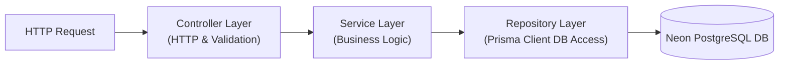

# 🏗️ Codebase Architecture Guide
**Task Management Portal Directory Layout & Design Patterns**

---

## 📂 1. Directory Structure

The repository is structured as a monorepo containing decoupled directories for the client SPA and the API server, ensuring separate development environments.

```
/task-management-portal
│
├── frontend/                     # React Client SPA
│   ├── public/                   # Static browser assets
│   ├── src/
│   │   ├── assets/               # CSS global styles, local media assets
│   │   ├── components/           # Reusable presentational components
│   │   │   ├── common/           # Button, Input, Modal, Loader
│   │   │   ├── dashboard/        # Analytics charts, summaries
│   │   │   └── tasks/            # TaskCard, TaskBoard, TaskForm
│   │   ├── context/              # Context API Providers
│   │   │   └── AuthContext.jsx   # Authentication State Provider
│   │   ├── hooks/                # Modular Custom React hooks
│   │   │   └── useAxios.js       # Secured network client hook
│   │   ├── pages/                # Route level entry layouts
│   │   │   ├── Login.jsx         # Access portal page
│   │   │   ├── Dashboard.jsx     # Overview board
│   │   │   └── ManageTasks.jsx   # Admin task coordinator list
│   │   ├── routes/               # Navigation routers & guards
│   │   │   └── PrivateRoute.jsx  # Authorization role controller
│   │   ├── services/             # Endpoint connection layers (Axios)
│   │   ├── App.jsx               # Client initialization
│   │   └── main.jsx              # React DOM mounting
│   ├── package.json
│   └── tailwind.config.js        # Design tokens
│
└── backend/                      # Node.js Express REST API
    ├── prisma/
    │   ├── migrations/           # Autogenerated DB migration tracking
    │   └── schema.prisma         # Database schemas
    ├── src/
    │   ├── config/               # Database, server, and environmental configs
    │   ├── controllers/          # API Handlers (Request parsing & routing status)
    │   ├── middlewares/          # Validation, Auth status checking
    │   │   ├── auth.middleware.js # JWT verification filter
    │   │   └── error.middleware.js # Central error responder
    │   ├── services/             # Core Business services
    │   ├── repositories/         # DB interfaces (Prisma client operations)
    │   ├── routes/               # Express Router routes mapping
    │   ├── utils/                # Password helpers, string parsers
    │   └── app.js                # App server orchestration
    ├── .env.example
    ├── package.json
    └── README.md
```

---

## 🏗️ 2. Architectural Design Patterns

To maintain a clean codebase as it scales, the project implements several key design patterns:

### 2.1 Controller-Service-Repository Pattern (Backend)
The backend architecture separates routing, business validation, and direct database access:



*   **Controller Layer**: Inspects incoming HTTP payloads, extracts routing params, triggers Zod validation checks, and sends matching HTTP codes.
*   **Service Layer**: Represents the transactional domain logic. Orchestrates calls to repositories and formats data structures (e.g. calculating priority points or trigger logs).
*   **Repository Layer (Prisma ORM)**: Executes direct database reads, writes, joins, and indexing structures.

### 2.2 Client-Side Zustand Authentication Store (Frontend)
The React client utilizes the **Zustand Store** pattern. Global authentication states, access tokens, loading markers, and API triggers are centralized inside a unified store (`authStore.js`). This allows components to inspect user details or trigger login handshakes reactively without wrapping page roots in Context Providers.

---

## 💻 3. Key Architectural Abstractions (Code Snippets)

### 3.1 Frontend: Custom Axios API Client with Rotation Interceptor
Centralized Axios instance dynamically appending in-memory JWT access tokens and intercepting status 401 to execute silent refresh token rotations.

```javascript
// src/api/apiClient.js
import axios from 'axios';
import { useAuthStore } from '../store/authStore';

const API_URL = import.meta.env.VITE_API_URL || 'http://localhost:5000/api';

export const apiClient = axios.create({
  baseURL: API_URL,
  withCredentials: true
});

apiClient.interceptors.request.use((config) => {
  const { accessToken } = useAuthStore.getState();
  if (accessToken) {
    config.headers.Authorization = `Bearer ${accessToken}`;
  }
  return config;
});
```

### 3.2 Backend: Decoupled Controller-Service Routing Implementation
Implementation pattern verifying separation of concerns between HTTP layers and domain logic.

```javascript
// src/controllers/task.controller.js
import { TaskService } from '../services/task.service.js';
import { taskSchema } from '../utils/validators.js';

export const createTaskController = async (req, res, next) => {
  try {
    // Validate request body using schemas
    const parsedData = taskSchema.parse(req.body);
    
    // Inject actor information verified from Auth middleware
    const creatorId = req.user.id;
    
    // Delegate processing logic to Service Layer
    const newTask = await TaskService.createTask(parsedData, creatorId);
    
    return res.status(201).json({
      success: true,
      message: "Task created successfully.",
      data: newTask
    });
  } catch (error) {
    next(error); // Route to global Express error middleware
  }
};
```

```javascript
// src/services/task.service.js
import { prisma } from '../config/db.js';

export class TaskService {
  static async createTask(data, creatorId) {
    // Database Operations are wrapped inside a safe transaction
    return await prisma.$transaction(async (tx) => {
      const task = await tx.task.create({
        data: {
          title: data.title,
          description: data.description,
          priority: data.priority,
          dueDate: new Date(data.dueDate),
          categoryId: data.categoryId,
          assigneeId: data.assigneeId,
          creatorId: creatorId,
        }
      });

      // Write Audit Log entry
      await tx.activityLog.create({
        data: {
          action: 'TASK_CREATED',
          details: `Task '${task.title}' was created and assigned.`,
          userId: creatorId,
          taskId: task.id
        }
      });

      return task;
    });
  }
}
```

## 📊 4. Dashboard Foundation & Integration Points

The Dashboard Module is built on a decoupled architecture, separating visual representations from the business database models. This foundation provides structural contracts that will seamlessly hook into future tables as they are implemented.

### 4.1 Component Hierarchy (Frontend)
The frontend utilizes a modular grid format composed of generic, decoupled visual cards:
```
Dashboard (page)
│
├── DashboardHeader (receives onSearch callback, handles debounce)
│
├── StatsCard (metrics representation, animated by framer-motion)
│
├── QuickActions (role-filtered button navigations)
│
├── ChartCard (generic wrappers injecting Recharts)
│   ├── Pie / Doughnut Chart
│   └── Bar / Line / Area Chart
│
├── ActivityCard (displays activity logs list)
│
└── NotificationCard (displays user alert logs list)
```

### 4.2 Data Flows
1.  **Auth Boot**: The route guard `ProtectedRoute` verifies session credentials.
2.  **Parallel Load**: React triggers parallel API fetches (`overview`, `activity`, `notifications`, `charts`) via `apiClient`.
3.  **Role Filter**: The server filters the response payload according to `req.user.role`.
4.  **State Render**: Zustand updates active state records, feeding responsive charting configurations.

### 4.3 Future Integration Roadmap
When the business modules are fully developed in later phases, the dashboard foundation integrates without refactoring:
*   **Prisma Aggregations**: The service layer `dashboard.service.js` will replace mock arrays with direct queries:
    *   *Overview stats*: `prisma.task.count({ where: { status: 'TODO' } })`.
    *   *Departments stats*: `prisma.department.count()`.
    *   *User assignments*: Filtering queries using relations: `prisma.task.findMany({ where: { assigneeId: userId } })`.
*   **Activity Logs**: Read records from the unified `ActivityLog` relational table.

## 👥 5. Employee Management Architecture & Repository Pattern

The Employee Module introduces an enterprise-grade architecture separating routing, payload validation, business rules, storage wrappers, and database queries.

### 5.1 Repository Pattern Implementation (Backend)
To decouple database operations from business logic and Prisma Client schemas, the repository layer `employee.repository.js` encapsulates all SQL-level transactions.
```javascript
// src/repositories/employee.repository.js
export class EmployeeRepository {
  static async findAndCount({ where, skip, take, orderBy }) {
    const [employees, total] = await Promise.all([
      prisma.employee.findMany({ where, skip, take, orderBy }),
      prisma.employee.count({ where })
    ]);
    return { employees, total };
  }
}
```

### 5.2 Storage Service Abstraction & Multer
Avatars are handled via a local disk storage layout using Multer. The controller calls a unified `StorageService` interface, isolating future migrations to Cloudinary or AWS S3:
```
[Multer Middleware] -> [StorageService.saveFile(file)] -> Returns Public URL Path
                                                      -> Deletes orphaned file on updates
```

### 5.3 Frontend Component Hierarchy
The employee listings page is designed using a declarative sub-component hierarchy:
```
Employees (page)
│
├── EmployeeFilters (handles search key debounce, dropdown tags, bulk edits, exports)
│
├── EmployeeTable (presents avatar grids, select list rows, and inline CRUD links)
│   └── Multi-select Selection Banner (ADMIN only toolbar)
│
└── EmployeePagination (footer offset navigator page controls)
```

## 🏢 6. Department Management Architecture & Workflows

The Department Module expands the system design by incorporating multi-relational database transaction scopes.

### 6.1 Transaction-Safe Assignments Repository (Backend)
To map manager assignments securely, a database `$transaction` block handles clearing existing assignments and mapping new linkages:
```javascript
// src/repositories/department.repository.js
static async assignManager(id, managerId, updatedById) {
  return prisma.$transaction(async (tx) => {
    // Enforce ONE department managed at a time
    if (managerId) {
      await tx.department.updateMany({
        where: { managerId, id: { not: id }, isDeleted: false },
        data: { managerId: null }
      });
    }
    // Update target department manager
    const department = await tx.department.update({
      where: { id },
      data: { managerId, updatedById }
    });
    // Ensure manager's department ID is updated
    if (managerId) {
      await tx.employee.update({
        where: { id: managerId },
        data: { departmentId: id }
      });
    }
    return department;
  });
}
```

### 6.2 Frontend Page & Modal Architecture
The layout incorporates code-split page views and modals:
```
Departments (page)
│
├── DepartmentToolbar (coordinates search input and action triggers)
│
├── DepartmentStatistics (renders global metrics aggregate panels)
│
├── BulkActionToolbar (actions selector for status/delete operations)
│
└── DepartmentTable (registers items grid)
```

Inside the Department Details view, sub-modals handle assignments:
*   `ManagerAssignmentModal`: Renders active employees select list, updating manager ID configurations.
*   `EmployeeAssignmentModal`: Renders checklist grids, linking multiple employees to the department in a single patch call.

## 📂 7. Project Management Architecture & Workflows

The Project Module utilizes many-to-many database structures using the `ProjectMember` join model.

### 7.1 Transactional Member Allocation Repository (Backend)
To assign project members safely, a transaction block deletes previous allocations and bulk inserts new ones after validating project state and employee profiles:
```javascript
// src/repositories/project.repository.js
static async assignMembers(id, members, updatedById) {
  return prisma.$transaction(async (tx) => {
    // 1. Verify project state
    const project = await tx.project.findUnique({ where: { id } });
    if (!project || project.isDeleted || project.status === 'CANCELLED') {
      throw new Error('Project invalid or cannot receive new members.');
    }
    // 2. Validate employee existence
    const employeeIds = members.map(m => m.employeeId);
    const count = await tx.employee.count({ where: { id: { in: employeeIds }, isDeleted: false } });
    if (count !== employeeIds.length) {
      throw new Error('One or more selected employees are invalid.');
    }
    // 3. Sync join memberships
    await tx.projectMember.deleteMany({ where: { projectId: id } });
    await tx.projectMember.createMany({
      data: members.map(m => ({ projectId: id, employeeId: m.employeeId, role: m.role }))
    });
    return await tx.project.update({ where: { id }, data: { updatedById } });
  });
}
```

### 7.2 Frontend Page & Modal Architecture
The layout incorporates code-split directory pages:
```
Projects (page)
│
├── ProjectToolbar (coordinates search input and action triggers)
│
├── ProjectStatistics (renders overall metrics aggregate cards)
│
└── ProjectTable (registers projects and links)
```

Inside the Project Details view:
*   `TimelineCard`: Calculates start and target dates, elapsed duration, and days remaining.
*   `ManagerAssignmentModal`: Renders employees selector dropdowns, assigning project manager.
*   `MemberAssignmentModal`: Renders checkboxes list with dropdown role allocations (`TEAM_LEAD`, `DEVELOPER`, `TESTER`, etc.) to map project members in a transaction.

---

## 🔗 Internal Configuration References

To understand how these directories and patterns connect to installation, security, and schema designs:
*   **System Interactions & Topology Diagrams**: [docs/system-design.md](file:///c:/Resume%20Project/Task%20Management%20Portal/docs/system-design.md)
*   **Authentication & Security Settings**: [docs/security-auth.md](file:///c:/Resume%20Project/Task%20Management%20Portal/docs/security-auth.md)
*   **Configuration Environment Options**: [docs/installation-deployment.md](file:///c:/Resume%20Project/Task%20Management%20Portal/docs/installation-deployment.md)
