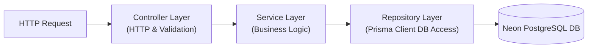

# 🏗️ Codebase Architecture Guide
**Task Management Portal Directory Layout & Design Patterns**

---

## 📂 1. Directory Structure

The repository is structured as a monorepo containing decoupled directories for the client SPA and the API server, ensuring separate development environments.

```
/task-management-portal
│
├── frontend/                     # React Client SPA
│   ├── public/                   # Static browser assets
│   ├── src/
│   │   ├── assets/               # CSS global styles, local media assets
│   │   ├── components/           # Reusable presentational components
│   │   │   ├── common/           # Button, Input, Modal, Loader
│   │   │   ├── dashboard/        # Analytics charts, summaries
│   │   │   └── tasks/            # TaskCard, TaskBoard, TaskForm
│   │   ├── context/              # Context API Providers
│   │   │   └── AuthContext.jsx   # Authentication State Provider
│   │   ├── hooks/                # Modular Custom React hooks
│   │   │   └── useAxios.js       # Secured network client hook
│   │   ├── pages/                # Route level entry layouts
│   │   │   ├── Login.jsx         # Access portal page
│   │   │   ├── Dashboard.jsx     # Overview board
│   │   │   └── ManageTasks.jsx   # Admin task coordinator list
│   │   ├── routes/               # Navigation routers & guards
│   │   │   └── PrivateRoute.jsx  # Authorization role controller
│   │   ├── services/             # Endpoint connection layers (Axios)
│   │   ├── App.jsx               # Client initialization
│   │   └── main.jsx              # React DOM mounting
│   ├── package.json
│   └── tailwind.config.js        # Design tokens
│
└── backend/                      # Node.js Express REST API
    ├── prisma/
    │   ├── migrations/           # Autogenerated DB migration tracking
    │   └── schema.prisma         # Database schemas
    ├── src/
    │   ├── config/               # Database, server, and environmental configs
    │   ├── controllers/          # API Handlers (Request parsing & routing status)
    │   ├── middlewares/          # Validation, Auth status checking
    │   │   ├── auth.middleware.js # JWT verification filter
    │   │   └── error.middleware.js # Central error responder
    │   ├── services/             # Core Business services
    │   ├── repositories/         # DB interfaces (Prisma client operations)
    │   ├── routes/               # Express Router routes mapping
    │   ├── utils/                # Password helpers, string parsers
    │   └── app.js                # App server orchestration
    ├── .env.example
    ├── package.json
    └── README.md
```

---

## 🏗️ 2. Architectural Design Patterns

To maintain a clean codebase as it scales, the project implements several key design patterns:

### 2.1 Controller-Service-Repository Pattern (Backend)
The backend architecture separates routing, business validation, and direct database access:



*   **Controller Layer**: Inspects incoming HTTP payloads, extracts routing params, triggers Zod validation checks, and sends matching HTTP codes.
*   **Service Layer**: Represents the transactional domain logic. Orchestrates calls to repositories and formats data structures (e.g. calculating priority points or trigger logs).
*   **Repository Layer (Prisma ORM)**: Executes direct database reads, writes, joins, and indexing structures.

### 2.2 Client-Side Authentication State Provider (Frontend)
The React client utilizes the **Context Provider** design pattern. The `AuthContext` wraps the entire app, exposing security actions (`login`, `logout`) and token variables to all components without manual prop-drilling.

---

## 💻 3. Key Architectural Abstractions (Code Snippets)

### 3.1 Frontend: Custom Axios Client Hook with Token Interceptor
Centralized network module automatically appending session contexts and reacting to token expiration.

```javascript
// src/hooks/useAxios.js
import axios from 'axios';
import { useNavigate } from 'react-router-dom';

const API_URL = import.meta.env.VITE_API_URL || 'http://localhost:5000/api';

export const useAxios = () => {
  const navigate = useNavigate();

  const client = axios.create({
    baseURL: API_URL,
    withCredentials: true, // Auto-send cookies containing HTTP-only JWT
  });

  // Response Interceptor handles authorization expiry
  client.interceptors.response.use(
    (response) => response,
    (error) => {
      if (error.response && error.response.status === 401) {
        // Clear locally stored session attributes
        localStorage.removeItem('user_session');
        // Route back to Login page
        navigate('/login');
      }
      return Promise.reject(error);
    }
  );

  return client;
};
```

### 3.2 Backend: Decoupled Controller-Service Routing Implementation
Implementation pattern verifying separation of concerns between HTTP layers and domain logic.

```javascript
// src/controllers/task.controller.js
import { TaskService } from '../services/task.service.js';
import { taskSchema } from '../utils/validators.js';

export const createTaskController = async (req, res, next) => {
  try {
    // Validate request body using schemas
    const parsedData = taskSchema.parse(req.body);
    
    // Inject actor information verified from Auth middleware
    const creatorId = req.user.id;
    
    // Delegate processing logic to Service Layer
    const newTask = await TaskService.createTask(parsedData, creatorId);
    
    return res.status(201).json({
      success: true,
      message: "Task created successfully.",
      data: newTask
    });
  } catch (error) {
    next(error); // Route to global Express error middleware
  }
};
```

```javascript
// src/services/task.service.js
import { prisma } from '../config/db.js';

export class TaskService {
  static async createTask(data, creatorId) {
    // Database Operations are wrapped inside a safe transaction
    return await prisma.$transaction(async (tx) => {
      const task = await tx.task.create({
        data: {
          title: data.title,
          description: data.description,
          priority: data.priority,
          dueDate: new Date(data.dueDate),
          categoryId: data.categoryId,
          assigneeId: data.assigneeId,
          creatorId: creatorId,
        }
      });

      // Write Audit Log entry
      await tx.activityLog.create({
        data: {
          action: 'TASK_CREATED',
          details: `Task '${task.title}' was created and assigned.`,
          userId: creatorId,
          taskId: task.id
        }
      });

      return task;
    });
  }
}
```

---

## 🔗 Internal Configuration References

To understand how these directories and patterns connect to installation, security, and schema designs:
*   **System Interactions & Topology Diagrams**: [docs/system-design.md](file:///c:/Resume%20Project/Task%20Management%20Portal/docs/system-design.md)
*   **Authentication & Security Settings**: [docs/security-auth.md](file:///c:/Resume%20Project/Task%20Management%20Portal/docs/security-auth.md)
*   **Configuration Environment Options**: [docs/installation-deployment.md](file:///c:/Resume%20Project/Task%20Management%20Portal/docs/installation-deployment.md)
