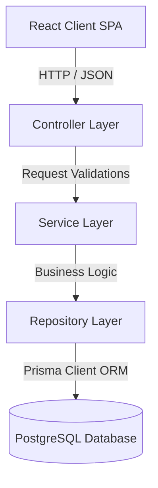

# Software Architecture & System Design Manual

This document details the architecture design patterns applied to the Task Management Portal.

## Layered Architecture Pattern

The codebase adheres strictly to a decoupled layered design:

### 1. Controller Layer
Exposes REST endpoints, parses path variables, validates payloads via `zod` schemas, and delegates to the Service Layer.

### 2. Service Layer
Contains core enterprise business rules, coordinates transaction boundaries, triggers background workers, dispatches activity logs, and raises socket notifications.

### 3. Repository Layer
Isolated data-access layer mapping SQL parameters and queries. No service business logic resides in this layer.

---

## Real-time Gateway Architecture

- **Websocket Gateway**: Orchestrated using Socket.io.
- **Client Synchronization**: Whenever a task, payroll, or project status updates, the backend triggers event-based socket broadcasts (`socket.to(projectId).emit(...)`).
- **Connection Diagnostics**: Renders dynamic network status gauges (online/offline indicators) on the client top nav bar.

---

## Background Worker Queue Design

Failed cron jobs automatically enter a retry loop with exponential backoff:
- Max attempts: 3.
- Backoff formula: `2^attempt * 1000` ms.
- Permanent failures are moved to the **Dead-Letter Queue (DLQ)** registry, marking `JobExecutionStatus` as `FAILED` and logging complete error traces.
