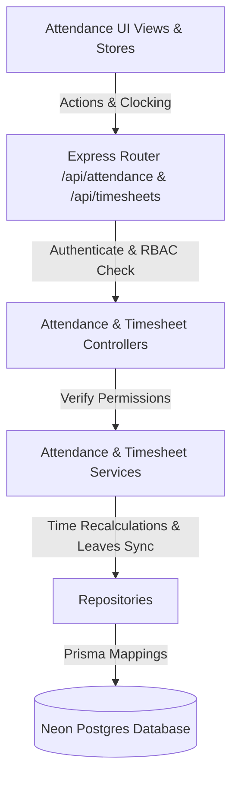

# ⏰ Attendance, Timesheet & Productivity Tracking Module

This document outlines the workflows, architectures, models, and calculations behind the Attendance and Timesheets Management System.

---

## 🏗️ 1. Architecture Flow

The module implements the standard Controller-Service-Repository layout:

---

## ⚡ 2. Work Session Engine

The daily logs timeline maps details into two database tables:
*   **Attendance**: Stores one daily row per employee recording `clockIn`, `clockOut`, `totalHours`, `breakDuration`, `overtimeHours`, and normalized `status` (`PRESENT`, `HALF_DAY`, `ABSENT`, `LEAVE`, `HOLIDAY`).
*   **WorkSession**: Records granular intervals of activity (`WORKING` or `BREAK`) containing `startTime` and `endTime`.

### 🌅 Clock-In & Break Workflows:
1.  **Clock-In**: Creates the daily `Attendance` log (defaults status to `PRESENT`, or `LEAVE` if approved leave exists) and starts an active `WorkSession` of type `WORKING`.
2.  **Start Break**: Completes the active `WORKING` session (populating `endTime`) and starts a new active `WorkSession` of type `BREAK`.
3.  **End Break**: Completes the active `BREAK` session and resumes a new active `WORKING` session.
4.  **Clock-Out**: Completes all active sessions, sets `clockOut` timestamp, and triggers calculations.

---

## ⚖️ 3. Calculation & Overtime Logic

Calculations are computed on the server side:

*   **Daily Working Hours**:
    $$\text{Working Hours} = \sum \frac{\text{Working WorkSession Duration (ms)}}{3,600,000}$$
*   **Break Duration**:
    $$\text{Break Duration (mins)} = \sum \frac{\text{Break WorkSession Duration (ms)}}{60,000}$$
*   **Daily Overtime**:
    $$\text{Overtime Hours} = \max(0, \text{Daily Working Hours} - 8)$$
*   **Attendance Percentage**:
    $$\text{Attendance \%} = \frac{\text{Present Days} + (\text{Half Days} \times 0.5)}{\text{Total Working Days in Month (excluding weekends)}} \times 100$$
*   **Average Check-In / Check-Out**:
    Computes the average minutes of day check-ins/outs occurred, formatted as `HH:MM`.

---

## 🌴 4. Leave Integration

If an employee has an approved leave request for a date:
*   The system checks for approved leaves when checking in or listing logs.
*   If found, the attendance status automatically defaults or synchronizes to `LEAVE`.
