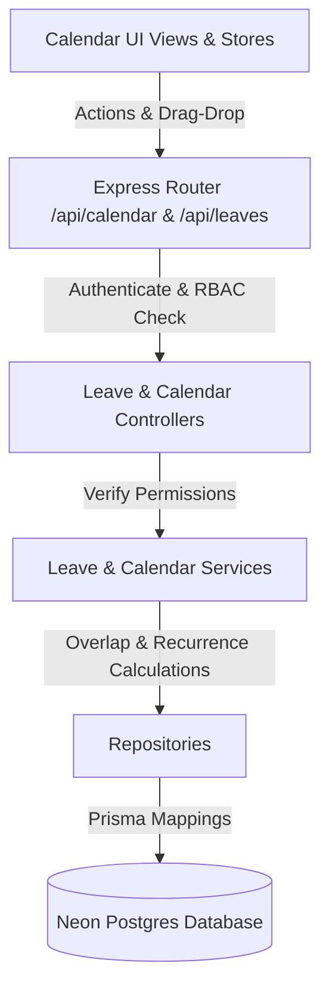
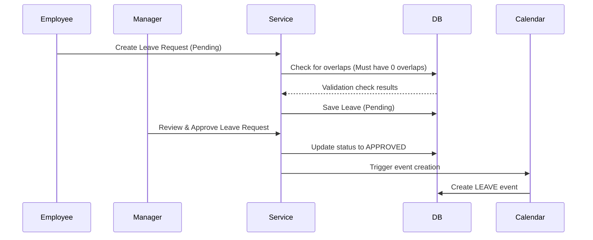

# 📅 Calendar, Scheduling & Leave Management Module

This document outlines the workflows, architectures, models, and engines behind the Calendar and Leaves Management System.

---

## 🏗️ 1. Architecture Flow

The module implements the standard Controller-Service-Repository layout:



---

## 🗄️ 2. Unified Event Model Shape

The calendar feed returns a unified JSON format compiling custom events, meetings, approved leaves, project milestones, and task deadlines:

```json
{
  "id": "event_uuid_or_reference_id",
  "title": "📋 Task: Database normalizations",
  "description": "Project: Backend API | Status: TODO",
  "type": "TASK",
  "startDate": "2026-08-10T09:00:00.000Z",
  "endDate": "2026-08-10T17:00:00.000Z",
  "isAllDay": true,
  "associatedEntityId": "task_uuid_reference",
  "code": "TSK-102",
  "color": "rgba(16, 185, 129, 0.15)"
}
```

---

## ⚡ 3. Recurring Event Engine

When a recurring event is registered (DAILY, WEEKLY, MONTHLY, YEARLY), the `generateOccurrences` scheduler lazily calculates dates and batch-saves `CalendarEvent` slots:
*   **Safety Limits**: To prevent database bloating, the engine calculates occurrences up to `recurrenceEndDate` or 3 months ahead by default.
*   **Recurrence Storage**: Rules are saved in the `RecurringEvent` table for lookup references.

---

## 🌴 4. Leave Request & Approval Workflow



*   **Cancel Request**: If a leave request is cancelled, the associated calendar event is deleted automatically.
