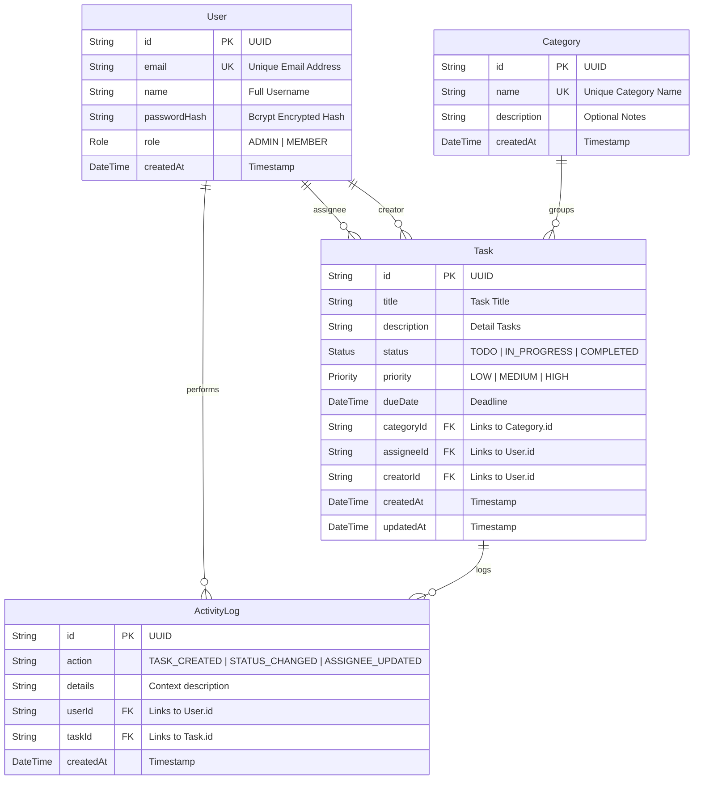

# 🗄️ Relational Database Design
**Task Management Portal Database Structure & ORM Modeling**

---

## 🏛️ 1. Design & Database Engine

The system uses **PostgreSQL** hosted on the serverless **Neon** database network. A relational architecture ensures data validation at the storage layer using primary keys, foreign key constraints, and cascading referential integrity rules.

---

## 📊 2. Database Normalization (3NF)

To ensure high performance, eliminate redundant updates, and protect data integrity, the schema is designed in **Third Normal Form (3NF)**:

### First Normal Form (1NF)
*   All table cells contain atomic values. For example, rather than storing user assignments or tags as a comma-separated text string, we break them into independent fields and foreign-key relations.

### Second Normal Form (2NF)
*   The schema satisfies 1NF, and all non-key fields depend entirely on the primary key. In the `Task` table, fields like `title`, `description`, `priority`, and `status` depend strictly on the primary key `id`. There are no partial dependencies.

### Third Normal Form (3NF)
*   The schema satisfies 2NF, and no non-key field transitively depends on any other non-key field. For instance, rather than storing the assignee's email or category descriptions directly in the `Task` record, we reference their respective primary keys (`assigneeId` -> `User.id`, `categoryId` -> `Category.id`). This isolates entity details and prevents anomalies if user properties or category names change.

---

## 📐 3. Entity-Relationship Diagram (ERD)

The database schema structure and entity links are modeled in the diagram below:



---

## 🧬 4. Complete Prisma Schema (`schema.prisma`)

This is the exact, production-ready schema configuration file compiling model fields, relational mappings, indexes, and database driver setups.

```prisma
// datasource configures the engine to target PostgreSQL
datasource db {
  provider = "postgresql"
  url      = env("DATABASE_URL")
}

// generator specifies compilation outputs for type-safe JS bindings
generator client {
  provider = "prisma-client-js"
}

// User role access levels
enum Role {
  ADMIN
  MEMBER
}

// Task execution states
enum Status {
  TODO
  IN_PROGRESS
  COMPLETED
}

// Task urgency priorities
enum Priority {
  LOW
  MEDIUM
  HIGH
}

model User {
  id           String        @id @default(uuid())
  email        String        @unique
  name         String
  passwordHash String
  role         Role          @default(MEMBER)
  createdAt    DateTime      @default(now())
  
  // Relations
  assignedTasks Task[]       @relation("TaskAssignee")
  createdTasks  Task[]       @relation("TaskCreator")
  activities    ActivityLog[]

  @@map("users")
}

model Category {
  id          String   @id @default(uuid())
  name        String   @unique
  description String?
  createdAt   DateTime @default(now())
  
  // Relations
  tasks       Task[]

  @@map("categories")
}

model Task {
  id          String      @id @default(uuid())
  title       String
  description String
  status      Status      @default(TODO)
  priority    Priority    @default(MEDIUM)
  dueDate     DateTime
  createdAt   DateTime    @default(now())
  updatedAt   DateTime    @updatedAt

  // Foreign keys
  categoryId  String
  assigneeId  String?
  creatorId   String

  // Relations
  category    Category    @relation(fields: [categoryId], references: [id], onDelete: Restrict)
  assignee    User?       @relation("TaskAssignee", fields: [assigneeId], references: [id], onDelete: SetNull)
  creator     User        @relation("TaskCreator", fields: [creatorId], references: [id], onDelete: Restrict)
  activities  ActivityLog[]

  // Indexes optimize queries on relationships, filters, and searches
  @@index([assigneeId])
  @@index([categoryId])
  @@index([status, priority])
  @@map("tasks")
}

model ActivityLog {
  id        String   @id @default(uuid())
  action    String
  details   String
  createdAt DateTime @default(now())

  // Foreign keys
  userId    String
  taskId    String

  // Relations
  user      User     @relation(fields: [userId], references: [id], onDelete: Cascade)
  task      Task     @relation(fields: [taskId], references: [id], onDelete: Cascade)

  @@index([userId])
  @@index([taskId])
  @@map("activity_logs")
}
```

---

## ⚡ 5. Indexing Design & Performance Analysis

Database lookups can slow down as transaction tables scale. The schema applies database indexes to prevent table-scan performance degradation:

1.  **Single-Column Relation Indexes**:
    *   `@@index([assigneeId])` on the `tasks` table. Prevents table-scans when compiling tasks for a specific user dashboard query: `SELECT * FROM tasks WHERE assigneeId = $1`.
    *   `@@index([categoryId])` on the `tasks` table. Speeds up sidebar navigation filters when users select custom categories.
2.  **Composite Filters Index**:
    *   `@@index([status, priority])` on the `tasks` table. Enhances API requests combining state values (e.g. searching for `HIGH` priority tasks still stuck in `TODO` status).
3.  **Unique Indexes**:
    *   Prisma automatically configures native unique indexes on `User(email)` and `Category(name)`. This speeds up verification checks during login actions and duplicate category prevention logic.

---

## 🔗 Architecture & API Reference Links

*   To inspect structural diagrams of component topologies: [docs/system-design.md](file:///c:/Resume%20Project/Task%20Management%20Portal/docs/system-design.md)
*   To review API JSON schemas consuming these models: [docs/api-documentation.md](file:///c:/Resume%20Project/Task%20Management%20Portal/docs/api-documentation.md)
