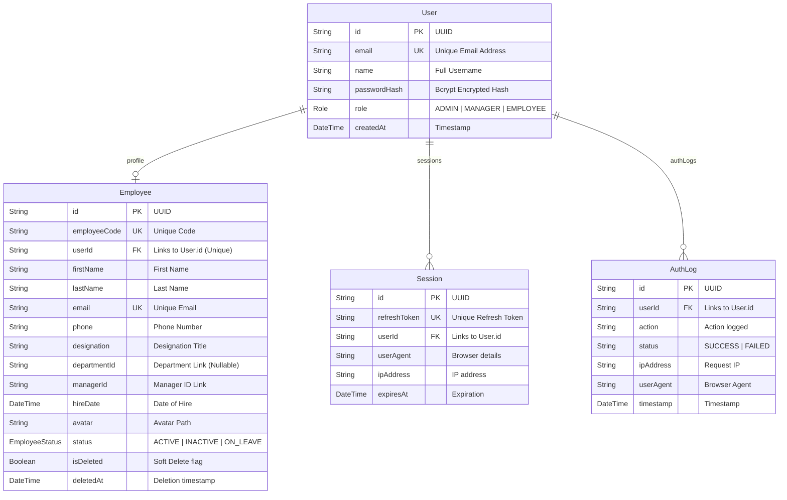

# 🗄️ Relational Database Design
**Task Management Portal Database Structure & ORM Modeling**

---

## 🏛️ 1. Design & Database Engine

The system uses **PostgreSQL** hosted on the serverless **Neon** database network. A relational architecture ensures data validation at the storage layer using primary keys, foreign key constraints, and cascading referential integrity rules.

---

## 📊 2. Database Normalization (3NF)

To ensure high performance, eliminate redundant updates, and protect data integrity, the schema is designed in **Third Normal Form (3NF)**:

### First Normal Form (1NF)
*   All table cells contain atomic values. For example, rather than storing user assignments or tags as a comma-separated text string, we break them into independent fields and foreign-key relations.

### Second Normal Form (2NF)
*   The schema satisfies 1NF, and all non-key fields depend entirely on the primary key. In the `Task` table, fields like `title`, `description`, `priority`, and `status` depend strictly on the primary key `id`. There are no partial dependencies.

### Third Normal Form (3NF)
*   The schema satisfies 2NF, and no non-key field transitively depends on any other non-key field. For instance, rather than storing the assignee's email or category descriptions directly in the `Task` record, we reference their respective primary keys (`assigneeId` -> `User.id`, `categoryId` -> `Category.id`). This isolates entity details and prevents anomalies if user properties or category names change.

---

## 📐 3. Entity-Relationship Diagram (ERD)

The database schema structure and entity links are modeled in the diagram below:



---

## 🧬 4. Complete Prisma Schema (`schema.prisma`)

This is the exact, production-ready schema configuration file compiling model fields, relational mappings, indexes, and database driver setups.

```prisma
datasource db {
  provider  = "postgresql"
  url       = env("DATABASE_URL")
  directUrl = env("DIRECT_URL")
}

generator client {
  provider = "prisma-client-js"
}

enum Role {
  ADMIN
  MANAGER
  EMPLOYEE
}

enum EmployeeStatus {
  ACTIVE
  INACTIVE
  ON_LEAVE
}

model User {
  id           String    @id @default(uuid())
  email        String    @unique
  name         String
  passwordHash String
  role         Role      @default(EMPLOYEE)
  createdAt    DateTime  @default(now())
  updatedAt    DateTime  @updatedAt
  
  // Relations
  sessions     Session[]
  authLogs     AuthLog[]
  employee     Employee?

  @@map("users")
}

model Session {
  id           String   @id @default(uuid())
  refreshToken String   @unique
  userId       String
  userAgent    String
  ipAddress    String
  expiresAt    DateTime
  createdAt    DateTime @default(now())
  updatedAt    DateTime @updatedAt

  // Relations
  user         User     @relation(fields: [userId], references: [id], onDelete: Cascade)

  @@index([userId])
  @@map("sessions")
}

model AuthLog {
  id        String   @id @default(uuid())
  userId    String?
  action    String
  status    String
  ipAddress String
  userAgent String
  timestamp DateTime @default(now())

  // Relations
  user      User?    @relation(fields: [userId], references: [id], onDelete: SetNull)

  @@index([userId])
  @@map("auth_logs")
}

model Employee {
  id                 String         @id @default(uuid())
  employeeCode       String         @unique
  userId             String?        @unique
  firstName          String
  lastName           String
  email              String         @unique
  phone              String
  designation        String
  departmentId       String?        
  managerId          String?        // Nullable
  hireDate           DateTime
  avatar             String?
  status             EmployeeStatus @default(ACTIVE)
  isDeleted          Boolean        @default(false)
  deletedAt          DateTime?
  
  // Audit properties
  createdById        String?
  updatedById        String?
  deletedById        String?
  
  createdAt          DateTime       @default(now())
  updatedAt          DateTime       @updatedAt

  // Relations
  user               User?          @relation(fields: [userId], references: [id], onDelete: SetNull)
  department         Department?    @relation("DepartmentEmployees", fields: [departmentId], references: [id], onDelete: SetNull)
  managedDepartments Department[]   @relation("DepartmentManager")

  @@index([employeeCode])
  @@index([email])
  @@index([status])
  @@index([managerId])
  @@map("employees")
}

enum DepartmentStatus {
  ACTIVE
  INACTIVE
}

model Department {
  id           String           @id @default(uuid())
  name         String           @unique
  code         String           @unique
  description  String?
  managerId    String?          // Links to Employee.id (Nullable)
  location     String
  email        String
  phone        String
  status       DepartmentStatus @default(ACTIVE)
  isDeleted    Boolean          @default(false)
  deletedAt    DateTime?

  // Audit Fields
  createdById  String?
  updatedById  String?
  deletedById  String?

  createdAt    DateTime         @default(now())
  updatedAt    DateTime         @updatedAt

  // Relations
  employees    Employee[]       @relation("DepartmentEmployees")
  manager      Employee?        @relation("DepartmentManager", fields: [managerId], references: [id], onDelete: SetNull)
  projects     Project[]        @relation("DepartmentProjects")

  @@index([code])
  @@index([status])
  @@index([managerId])
  @@index([createdAt])
  @@map("departments")
}

enum ProjectStatus {
  PLANNING
  ACTIVE
  ON_HOLD
  COMPLETED
  CANCELLED
}

enum ProjectPriority {
  LOW
  MEDIUM
  HIGH
  CRITICAL
}

enum ProjectMemberRole {
  PROJECT_MANAGER
  TEAM_LEAD
  DEVELOPER
  TESTER
  DESIGNER
  BUSINESS_ANALYST
  MEMBER
}

model Project {
  id           String          @id @default(uuid())
  code         String          @unique
  name         String
  description  String?
  departmentId String
  managerId    String?         
  startDate    DateTime
  endDate      DateTime
  priority     ProjectPriority @default(MEDIUM)
  status       ProjectStatus   @default(PLANNING)
  budget       Float?
  progress     Int             @default(0)
  isDeleted    Boolean         @default(false)
  deletedAt    DateTime?

  // Audit Fields
  createdById  String?
  updatedById  String?
  deletedById  String?

  createdAt    DateTime        @default(now())
  updatedAt    DateTime        @updatedAt

  // Relations
  department   Department      @relation("DepartmentProjects", fields: [departmentId], references: [id], onDelete: Restrict)
  manager      Employee?       @relation("ProjectManager", fields: [managerId], references: [id], onDelete: SetNull)
  members      ProjectMember[]

  @@index([code])
  @@index([status])
  @@index([priority])
  @@index([departmentId])
  @@index([managerId])
  @@map("projects")
}

model ProjectMember {
  id         String            @id @default(uuid())
  projectId  String
  employeeId String
  role       ProjectMemberRole @default(MEMBER)
  joinedAt   DateTime          @default(now())

  // Relations
  project    Project           @relation(fields: [projectId], references: [id], onDelete: Cascade)
  employee   Employee          @relation(fields: [employeeId], references: [id], onDelete: Cascade)

  @@unique([projectId, employeeId])
  @@index([projectId])
  @@index([employeeId])
  @@map("project_members")
}

enum TaskStatus {
  TODO
  IN_PROGRESS
  IN_REVIEW
  BLOCKED
  COMPLETED
  CANCELLED
}

enum TaskPriority {
  LOW
  MEDIUM
  HIGH
  URGENT
}

enum TaskType {
  FEATURE
  BUG
  IMPROVEMENT
  DOCUMENTATION
  RESEARCH
}

model Task {
  id                   String           @id @default(uuid())
  taskCode             String           @unique
  title                String
  description          String?
  projectId            String
  parentTaskId         String?
  reporterId           String?          
  status               TaskStatus       @default(TODO)
  priority             TaskPriority     @default(MEDIUM)
  type                 TaskType         @default(FEATURE)
  dueDate              DateTime?
  estimatedHours       Float?
  actualHours          Float?
  completionPercentage Int              @default(0)
  isDeleted            Boolean          @default(false)
  deletedAt            DateTime?

  // Audit Fields
  createdById          String?
  updatedById          String?
  deletedById          String?

  createdAt            DateTime         @default(now())
  updatedAt            DateTime         @updatedAt

  // Relations
  project              Project          @relation("ProjectTasks", fields: [projectId], references: [id], onDelete: Cascade)
  parentTask           Task?            @relation("SubTasks", fields: [parentTaskId], references: [id], onDelete: NoAction, onUpdate: NoAction)
  subTasks             Task[]           @relation("SubTasks")
  reporter             Employee?        @relation("ReporterTasks", fields: [reporterId], references: [id], onDelete: SetNull)
  assignees            TaskAssignee[]
  comments             TaskComment[]
  attachments          TaskAttachment[]
  dependencies         TaskDependency[] @relation("TaskDependent")
  blockedTasks         TaskDependency[] @relation("TaskBlocked")
  labels               TaskLabel[]      @relation("TaskLabels")

  @@index([taskCode])
  @@index([status])
  @@index([priority])
  @@index([projectId])
  @@index([parentTaskId])
  @@index([reporterId])
  @@map("tasks")
}

model TaskAssignee {
  id         String   @id @default(uuid())
  taskId     String
  employeeId String
  assignedAt DateTime @default(now())

  // Relations
  task       Task     @relation(fields: [taskId], references: [id], onDelete: Cascade)
  employee   Employee @relation(fields: [employeeId], references: [id], onDelete: Cascade)

  @@unique([taskId, employeeId])
  @@index([taskId])
  @@index([employeeId])
  @@map("task_assignees")
}

model TaskDependency {
  id              String   @id @default(uuid())
  taskId          String
  dependsOnTaskId String
  createdAt       DateTime @default(now())

  // Relations
  task            Task     @relation("TaskDependent", fields: [taskId], references: [id], onDelete: Cascade)
  dependsOnTask   Task     @relation("TaskBlocked", fields: [dependsOnTaskId], references: [id], onDelete: Cascade)

  @@unique([taskId, dependsOnTaskId])
  @@index([taskId])
  @@index([dependsOnTaskId])
  @@map("task_dependencies")
}

model TaskComment {
  id         String    @id @default(uuid())
  taskId     String
  employeeId String
  comment    String
  isDeleted  Boolean   @default(false)
  deletedAt  DateTime?
  createdAt  DateTime  @default(now())
  updatedAt  DateTime  @updatedAt

  // Relations
  task       Task      @relation(fields: [taskId], references: [id], onDelete: Cascade)
  employee   Employee  @relation(fields: [employeeId], references: [id], onDelete: Cascade)

  @@index([taskId])
  @@index([employeeId])
  @@map("task_comments")
}

model TaskAttachment {
  id           String   @id @default(uuid())
  taskId       String
  fileName     String
  filePath     String
  fileType     String
  uploadedById String
  createdAt    DateTime @default(now())

  // Relations
  task         Task     @relation(fields: [taskId], references: [id], onDelete: Cascade)
  uploader     Employee @relation("UploaderAttachments", fields: [uploadedById], references: [id], onDelete: Cascade)

  @@index([taskId])
  @@index([uploadedById])
  @@map("task_attachments")
}

model TaskLabel {
  id        String   @id @default(uuid())
  name      String   @unique
  color     String
  createdAt DateTime @default(now())
  updatedAt DateTime @updatedAt

  // Relations
  tasks     Task[]   @relation("TaskLabels")

  @@map("task_labels")
}
```

---

## ⚡ 5. Indexing Design & Performance Analysis

Database lookups can slow down as transaction tables scale. The schema applies database indexes to prevent table-scan performance degradation:

1.  **Single-Column Relation Indexes**:
    *   `@@index([userId])` on the `sessions` table. Prevents table-scans when verifying current sessions.
    *   `@@index([userId])` on the `auth_logs` table. Enhances log tracking queries.
    *   `@@index([managerId])` on the `employees` table. Speeds up managers reading their team lists.
    *   `@@index([managerId])` on the `departments` table. Speeds up manager lookup listings.
    *   `@@index([createdAt])` on the `departments` table. Speeds up pagination ordering.
    *   `@@index([departmentId])` and `@@index([managerId])` on the `projects` table. Speeds up filtering queries.
    *   `@@index([projectId])` and `@@index([employeeId])` on the `project_members` join table. Speeds up relational mapping scans.
    *   `@@index([projectId])`, `@@index([parentTaskId])`, and `@@index([reporterId])` on the `tasks` table. Speeds up tree queries.
    *   `@@index([taskId])` and `@@index([employeeId])` on `task_assignees` and `task_comments` tables.
    *   `@@index([taskId])` and `@@index([dependsOnTaskId])` on the `task_dependencies` blocker table.
2.  **Unique Indexes**:
    *   Prisma automatically configures native unique indexes on `User(email)`, `Employee(email)`, `Employee(employeeCode)`, `Department(email)`, `Department(name)`, `Department(code)`, `Project(code)`, `Task(taskCode)`, and `TaskLabel(name)`.
    *   `@@unique([projectId, employeeId])` on `project_members` to enforce single mapping logic.
    *   `@@unique([taskId, employeeId])` on `task_assignees` to block duplicate memberships.
    *   `@@unique([taskId, dependsOnTaskId])` on `task_dependencies` to block duplicate blocker mappings.
3.  **Filtered Search Indexes**:
    *   `@@index([status])` on the `employees` table.
    *   `@@index([code])` and `@@index([status])` on the `departments` table.
    *   `@@index([code])`, `@@index([status])`, and `@@index([priority])` on the `projects` table.
    *   `@@index([taskCode])`, `@@index([status])`, and `@@index([priority])` on the `tasks` table.

---

## 📈 6. Analytics Query Performance & Aggregates

The analytics engine uses Postgres index-only scans and aggregate functions (`COUNT(*)`, `AVG(progress)`, `AVG(completionPercentage)`) to avoid loading large record datasets into Node.js server memory:

1.  **Zebra-Scan Aggregations**:
    *   Instead of pulling all projects to calculate progress, `prisma.project.aggregate({ _avg: { progress: true } })` is executed.
    *   This is highly optimized by Postgres' `B-Tree` index on the `status` and `isDeleted` columns.
2.  **Date-Range Scans**:
    *   Date filters map to `createdAt` index ranges `gte` and `lte` preventing database scans on large transaction tables.
3.  **Role-Based Access Queries**:
    *   Where conditions filter by `departmentId` or task assignee `employeeId` before executing aggregates, keeping computation localized.

---

## 📅 7. Calendar & Scheduling Indexes

To optimize range searches and lookup queries across calendar and scheduling tables, indexes are configured on the following attributes:

1.  **Leave Request Indexes**:
    *   `@@index([employeeId])` — speeds up personal leave logs checks.
    *   `@@index([status])` — speeds up pending review list queries.
    *   `@@index([startDate])` and `@@index([endDate])` — speeds up leave overlap checks.
2.  **Calendar Event Indexes**:
    *   `@@index([startDate])` and `@@index([endDate])` — speeds up monthly/weekly date view queries.
    *   `@@index([type])` — speeds up category filters scans.
    *   `@@index([employeeId])`, `@@index([projectId])`, `@@index([taskId])` — speeds up relationship query joins.

---

## ⏰ 8. Attendance & Timesheet Indexes (Phase 11)

To optimize lookup queries and range queries inside the attendance module, database indexes are defined on:

1.  **Attendance Model Indexes**:
    *   `@@unique([employeeId, date])` — ensures unique clock-in logs per day per employee.
    *   `@@index([employeeId])` — speeds up employee logs filter queries.
    *   `@@index([date])` — optimizes date range query speeds.
    *   `@@index([status])` — optimizes status filters checking.
2.  **AttendanceRequest Model Indexes**:
    *   `@@index([employeeId])` — optimizes personal request lists.
    *   `@@index([status])` — speeds up manager review queues.
3.  **Timesheet Model Indexes**:
    *   `@@index([employeeId])` — speeds up personal and team timesheet lookups.

---

## 📂 9. Document & File Management Indexes (Phase 12)

To optimize file matching, lookup queries, and uploader references speeds:

1.  **Document Model Indexes**:
    *   `@@index([entityType])` — speeds up reference scope grouping.
    *   `@@index([entityId])` — optimizes matching entity references lookups.
    *   `@@index([uploadedById])` — optimizes uploader employee details lookups.
    *   `@@index([createdAt])` — speeds up sorted lists.
    *   `@@index([status])` — speeds up status lookups.
2.  **DocumentVersion Model Indexes**:
    *   `@@unique([documentId, versionNumber])` — prevents version number duplication.
    *   `@@index([documentId])` — speeds up version list queries.
    *   `@@index([uploadedById])` — optimizes revision author tracking lookups.

---

## 🔗 Architecture & API Reference Links

*   To inspect structural diagrams of component topologies: [docs/system-design.md](file:///c:/Resume%20Project/Task%20Management%20Portal/docs/system-design.md)
*   To review API JSON schemas consuming these models: [docs/api-documentation.md](file:///c:/Resume%20Project/Task%20Management%20Portal/docs/api-documentation.md)
