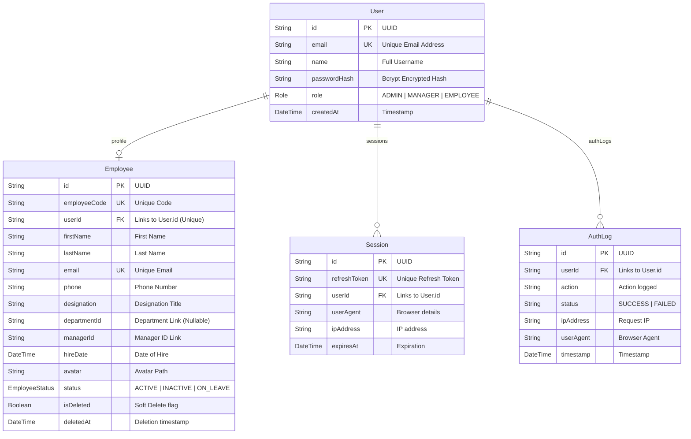

# 🗄️ Relational Database Design
**Task Management Portal Database Structure & ORM Modeling**

---

## 🏛️ 1. Design & Database Engine

The system uses **PostgreSQL** hosted on the serverless **Neon** database network. A relational architecture ensures data validation at the storage layer using primary keys, foreign key constraints, and cascading referential integrity rules.

---

## 📊 2. Database Normalization (3NF)

To ensure high performance, eliminate redundant updates, and protect data integrity, the schema is designed in **Third Normal Form (3NF)**:

### First Normal Form (1NF)
*   All table cells contain atomic values. For example, rather than storing user assignments or tags as a comma-separated text string, we break them into independent fields and foreign-key relations.

### Second Normal Form (2NF)
*   The schema satisfies 1NF, and all non-key fields depend entirely on the primary key. In the `Task` table, fields like `title`, `description`, `priority`, and `status` depend strictly on the primary key `id`. There are no partial dependencies.

### Third Normal Form (3NF)
*   The schema satisfies 2NF, and no non-key field transitively depends on any other non-key field. For instance, rather than storing the assignee's email or category descriptions directly in the `Task` record, we reference their respective primary keys (`assigneeId` -> `User.id`, `categoryId` -> `Category.id`). This isolates entity details and prevents anomalies if user properties or category names change.

---

## 📐 3. Entity-Relationship Diagram (ERD)

The database schema structure and entity links are modeled in the diagram below:



---

## 🧬 4. Complete Prisma Schema (`schema.prisma`)

This is the exact, production-ready schema configuration file compiling model fields, relational mappings, indexes, and database driver setups.

```prisma
datasource db {
  provider  = "postgresql"
  url       = env("DATABASE_URL")
  directUrl = env("DIRECT_URL")
}

generator client {
  provider = "prisma-client-js"
}

enum Role {
  ADMIN
  MANAGER
  EMPLOYEE
}

enum EmployeeStatus {
  ACTIVE
  INACTIVE
  ON_LEAVE
}

model User {
  id           String    @id @default(uuid())
  email        String    @unique
  name         String
  passwordHash String
  role         Role      @default(EMPLOYEE)
  createdAt    DateTime  @default(now())
  updatedAt    DateTime  @updatedAt
  
  // Relations
  sessions     Session[]
  authLogs     AuthLog[]
  employee     Employee?

  @@map("users")
}

model Session {
  id           String   @id @default(uuid())
  refreshToken String   @unique
  userId       String
  userAgent    String
  ipAddress    String
  expiresAt    DateTime
  createdAt    DateTime @default(now())
  updatedAt    DateTime @updatedAt

  // Relations
  user         User     @relation(fields: [userId], references: [id], onDelete: Cascade)

  @@index([userId])
  @@map("sessions")
}

model AuthLog {
  id        String   @id @default(uuid())
  userId    String?
  action    String
  status    String
  ipAddress String
  userAgent String
  timestamp DateTime @default(now())

  // Relations
  user      User?    @relation(fields: [userId], references: [id], onDelete: SetNull)

  @@index([userId])
  @@map("auth_logs")
}

model Employee {
  id           String         @id @default(uuid())
  employeeCode String         @unique
  userId       String?        @unique
  firstName    String
  lastName     String
  email        String         @unique
  phone        String
  designation  String
  departmentId String?        // Nullable - future ready
  managerId    String?        // Nullable
  hireDate     DateTime
  avatar       String?
  status       EmployeeStatus @default(ACTIVE)
  isDeleted    Boolean        @default(false)
  deletedAt    DateTime?
  
  // Audit properties
  createdById  String?
  updatedById  String?
  deletedById  String?
  
  createdAt    DateTime       @default(now())
  updatedAt    DateTime       @updatedAt

  // Relations
  user         User?          @relation(fields: [userId], references: [id], onDelete: SetNull)

  @@index([employeeCode])
  @@index([email])
  @@index([status])
  @@index([managerId])
  @@map("employees")
}
```

---

## ⚡ 5. Indexing Design & Performance Analysis

Database lookups can slow down as transaction tables scale. The schema applies database indexes to prevent table-scan performance degradation:

1.  **Single-Column Relation Indexes**:
    *   `@@index([userId])` on the `sessions` table. Prevents table-scans when verifying current sessions.
    *   `@@index([userId])` on the `auth_logs` table. Enhances log tracking queries.
    *   `@@index([managerId])` on the `employees` table. Speeds up managers reading their team lists.
2.  **Unique Indexes**:
    *   Prisma automatically configures native unique indexes on `User(email)`, `Employee(email)`, and `Employee(employeeCode)`. This speeds up verification checks during signup actions and unique code lookups.
3.  **Filtered Search Indexes**:
    *   `@@index([status])` on the `employees` table. Speeds up rendering stats filtered by ACTIVE or ON_LEAVE states.

---

## 🔗 Architecture & API Reference Links

*   To inspect structural diagrams of component topologies: [docs/system-design.md](file:///c:/Resume%20Project/Task%20Management%20Portal/docs/system-design.md)
*   To review API JSON schemas consuming these models: [docs/api-documentation.md](file:///c:/Resume%20Project/Task%20Management%20Portal/docs/api-documentation.md)
