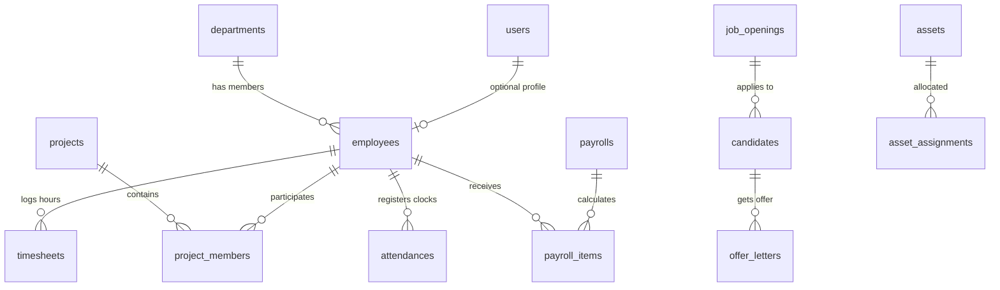

# Database Schema & Optimization Documentation

This document describes the PostgreSQL database layout and index optimization choices.

## Database Entity Relationship Diagram Overview
The schema is designed using Prisma ORM with strict referential integrity:

---

## Performance Indexing Decisions

To optimize performance and avoid slow table scans on foreign keys, the following indexes are configured:

1. **Employee Lookups**:
   - Unique index on `employees.email` and `employees.employeeCode`.
   - Index on `employees.departmentId` for department roster listings.

2. **Real-time Chat Messaging**:
   - Compound index on `chat_messages(projectId, createdAt DESC)` for fast historical retrievals.

3. **Logins & Audit Trails**:
   - Compound index on `activity_logs(userId, createdAt DESC)`.

4. **Task Management Board**:
   - Compound index on `tasks(projectId, status)` for kanban board rendering queries.

5. **Timesheets & Payroll Calculations**:
   - Unique index on `payroll_items(payrollId, employeeId)` to prevent double payments.

---

## Critical Enums Definitions

- `Role`: `ADMIN`, `MANAGER`, `EMPLOYEE`, `HR`
- `EmployeeStatus`: `ACTIVE`, `SUSPENDED`, `TERMINATED`
- `AssetStatus`: `AVAILABLE`, `ASSIGNED`, `UNDER_MAINTENANCE`, `RETIRED`
- `PayrollStatus`: `DRAFT`, `GENERATED`, `APPROVED`, `PAID`, `CANCELLED`
- `JobExecutionStatus`: `PENDING`, `RUNNING`, `SUCCESS`, `FAILED`
