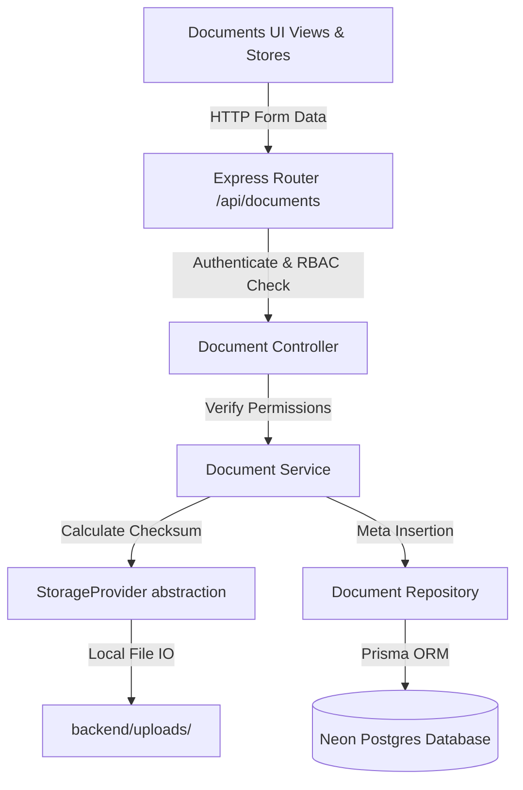

# 📂 Document & File Management Module

This document outlines the workflows, architectures, models, and security validations behind the Document and File Management System.

---

## 🏗️ 1. Architecture Flow

The module implements the decoupled Storage Provider contract to allow replacing Local Storage with S3 or Google Cloud storage in the future:

---

## 🔒 2. Storage & Decoupling Abstractions

The system enforces a strict `StorageProvider` base interface class:
*   `upload(file)`: Writes binary buffers, returns filenames, paths, and calculated checksums.
*   `download(storedFilename)`: Resolves file read streams.
*   `delete(storedFilename)`: Purges disk files.
*   `exists(storedFilename)`: Checks existence.

The active implementation uses the `LocalStorageProvider` write stream, saving files to `backend/uploads/` relative to the server root.

---

## 🔄 3. Revision Versioning strategy

Uploading a document version does not replace existing version binaries:
1.  **Creation**: Sets `versionNumber = 1`.
2.  **Revision**: When a manager or employee uploads a file with the same document ID, the system looks up the highest current revision index, increments it by 1, and appends a new `DocumentVersion` child record.
3.  **Audit Trail**: Both the original values (checksum hashes, sizes, extensions) and uploader IDs are preserved.

---

## 🛡️ 4. Security & RBAC Scoping
*   **ADMIN**: Global reads, updates, and hard deletion of documents.
*   **MANAGER**: Manages resource documents under their respective department or project.
*   **EMPLOYEE**: Uploads and downloads own documents and assigned department files only.
*   **MIME Guard**: Strictly checks file name extensions. Rejects `.exe`, `.dll`, `.bat`, `.cmd`, `.sh`, and `.msi` formats. Maximum size is capped at 20 MB.
