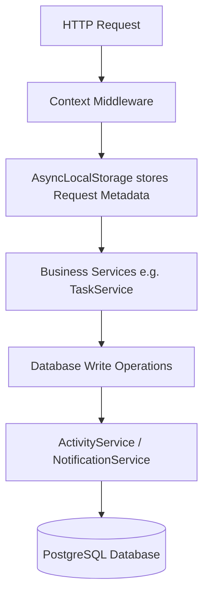

# 🔔 Notifications & Activity Logs System Design

This document details the architecture, design choices, database schema, and workflows of the enterprise-grade **Notifications and Activity Logging Module** (Phase 8).

---

## 🏗️ Architectural Overview

The module utilizes a **non-blocking asynchronous design** built on top of Prisma ORM and Express.js context storage hooks:

### Key Engineering Patterns

1. **Non-Blocking Execution (Crash Resilience)**:
   Notifications and activity logs must never interrupt primary business logic. If a notification database insertion fails, the main transactional thread swallows the exception, logs it to console, and continues.
   
2. **Global Context Injection via `AsyncLocalStorage`**:
   Rather than manually threading parameters like `ipAddress` or `userAgent` through every service method call, Express intercepts incoming requests via `context.middleware.js` and registers them in `AsyncLocalStorage`. The `ActivityService` queries this context automatically to fetch requester properties.

3. **Fine-grained Scoped Visibility (RBAC)**:
   * **ADMIN**: Full lookup permission over all logs and system notifications.
   * **MANAGER**: Scoped lookups restricted to employees belonging to their department.
   * **EMPLOYEE**: Restricted exclusively to their own logs and personal feed.

---

## 🗄️ Database Schema design

The tables are configured in Prisma as follows:

### 1. Notification Model
Represents user-specific in-app notifications.

* Fields:
  * `id`: UUID (Primary Key)
  * `userId`: UUID (Foreign Key linking to User)
  * `title`: String
  * `message`: Text
  * `type`: Enum (`TASK_ASSIGNED`, `TASK_UPDATED`, `TASK_COMPLETED`, `PROJECT_CREATED`, `PROJECT_UPDATED`, `COMMENT_ADDED`, `ATTACHMENT_ADDED`)
  * `priority`: Enum (`LOW`, `MEDIUM`, `HIGH`, `URGENT`)
  * `isRead`: Boolean (defaults to false)
  * `readAt`: DateTime (nullable)
  * `actionUrl`: String (nullable redirect path)
  * `createdAt`: DateTime
  
### 2. NotificationPreference Model
Allows users to configure what notification triggers they receive.

* Fields:
  * `id`: UUID (Primary key)
  * `userId`: UUID (Foreign Key, Unique)
  * `email`: Boolean (defaults to true)
  * `inApp`: Boolean (defaults to true)
  * `taskAssigned`: Boolean (defaults to true)
  * `taskUpdated`: Boolean (defaults to true)
  * `taskCompleted`: Boolean (defaults to true)
  * `projectCreated`: Boolean (defaults to true)
  * `projectUpdated`: Boolean (defaults to true)
  * `commentAdded`: Boolean (defaults to true)
  * `attachmentAdded`: Boolean (defaults to true)

### 3. ActivityLog Model
The audit log trail recording details of CRUD operations, exports, and status transitions.

* Fields:
  * `id`: UUID (Primary Key)
  * `userId`: UUID (Nullable for Guest actions)
  * `action`: Enum (`CREATE`, `UPDATE`, `DELETE`, `RESTORE`, `ASSIGN`, `UNASSIGN`, `LOGIN`, `LOGOUT`, `STATUS_CHANGE`, `COMMENT`, `UPLOAD`, `EXPORT`)
  * `entityType`: String (e.g. `EMPLOYEE`, `DEPARTMENT`, `PROJECT`, `TASK`)
  * `entityId`: String
  * `description`: Text
  * `ipAddress`: String
  * `userAgent`: String
  * `metadata`: JSON (capturing `{ before, after, changes }`)
  * `createdAt`: DateTime

---

## 🔌 API Endpoints Reference

### Notifications API
* `GET /api/notifications` - Paginated notification feed list
* `GET /api/notifications/unread` - Count of unread notifications
* `GET /api/notifications/preferences` - Fetch notification preferences toggles
* `PATCH /api/notifications/preferences` - Update subscription options
* `PATCH /api/notifications/read-all` - Mark all notifications as read
* `PATCH /api/notifications/:id/read` - Mark single notification as read
* `DELETE /api/notifications/bulk` - Bulk delete list of notifications
* `DELETE /api/notifications/:id` - Delete single notification
* `GET /api/notifications/export` - Export notifications list to CSV format

### Activity Logs API
* `GET /api/activity` - List audit logs with pagination and search
* `GET /api/activity/:id` - Retrieve metadata detail log
* `GET /api/activity/entity/:entityType/:entityId` - Retrieve audit trail of a specific record
* `GET /api/activity/user/:userId` - Retrieve audit trail of a specific employee user
* `GET /api/activity/export` - Export audit logs matching query parameters to CSV
