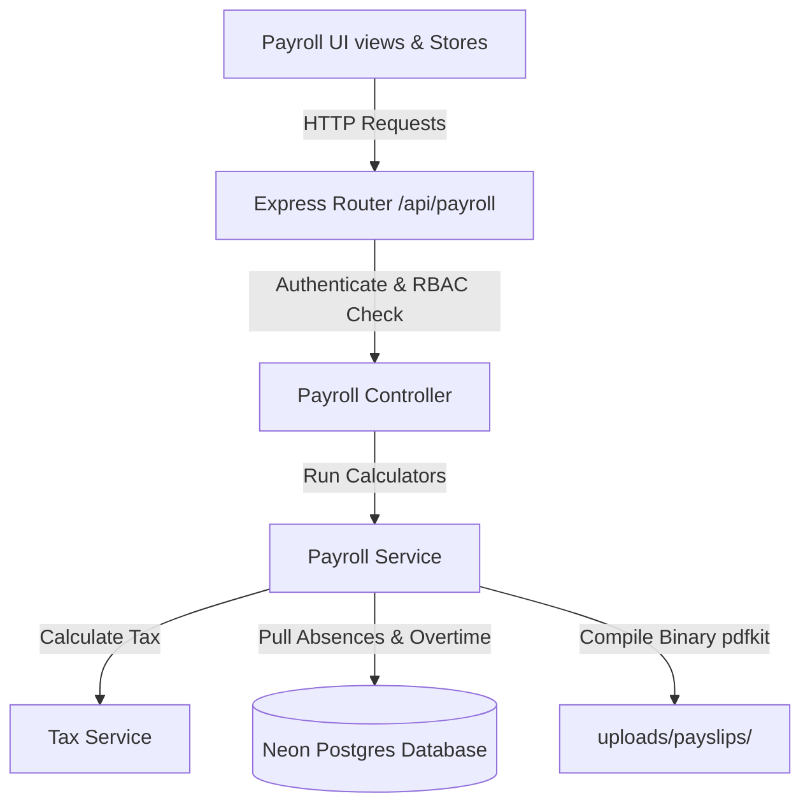

# 💳 Payroll & Salary Management Module

This document outlines the workflows, mathematical formulas, progressive tax slabs, and PDF generation pipeline behind the Payroll System.

---

## 🏗️ 1. Architecture Flow

The payroll module integrates with existing systems using standard decouple principles:

---

## 📐 2. Payroll Calculations Math

The engine compiles monthly payroll items using the following formulas:

1.  **Gross Salary**:
    $$\text{Gross Salary} = \text{Basic Salary} + \text{Allowances} + \text{Bonuses} + \text{Overtime Pay}$$
2.  **Overtime Earnings**:
    $$\text{Overtime Pay} = \text{Hourly Rate} \times 1.5 \times \text{Overtime Hours}$$
    Where:
    $$\text{Hourly Rate} = \frac{\text{Basic Salary}}{\text{Working Days} \times 8}$$
3.  **Deductions**:
    $$\text{Deductions} = \text{Absent Deductions} + \text{Half Day Deductions} + \text{Unpaid Leave Deductions} + \text{Structure Deductions}$$
    Where:
    $$\text{Absent Deduction} = \text{Absent Days} \times \text{Daily Salary}$$
    $$\text{Half Day Deduction} = \text{Half Days} \times 0.5 \times \text{Daily Salary}$$
    $$\text{Unpaid Leave Deduction} = \text{Unpaid Leave Days} \times \text{Daily Salary}$$
    $$\text{Daily Salary} = \frac{\text{Basic Salary}}{\text{Working Days}}$$
4.  **Net Salary**:
    $$\text{Net Salary} = \max(0, \text{Gross Salary} - \text{Tax} - \text{Deductions})$$

---

## 📈 3. Progressive Tax Bracket Engine

Tax deductions are calculated by evaluating progressive income brackets fetched from the database `TaxRule` table:

*   For each bracket, the taxable income is calculated:
    $$\text{Taxable Segment} = \min(\text{Gross Salary}, \text{Max Income}) - \text{Min Income}$$
*   The tax for that segment is computed and added to the total:
    $$\text{Segment Tax} = \text{Taxable Segment} \times \text{Tax Rate}$$

---

## 📄 4. PDF Statement Generation

Payslips are compiled on the server side using the `pdfkit` stream library. The resulting files are stored at `uploads/payslips/:id.pdf` and directly streamed to authorized clients upon download request.
