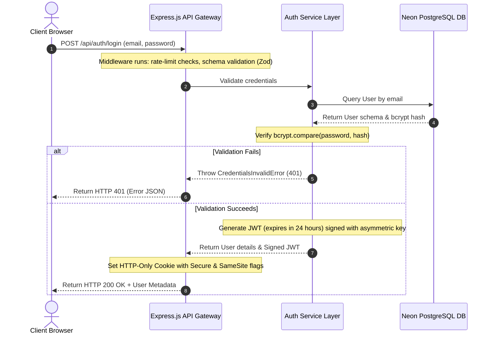
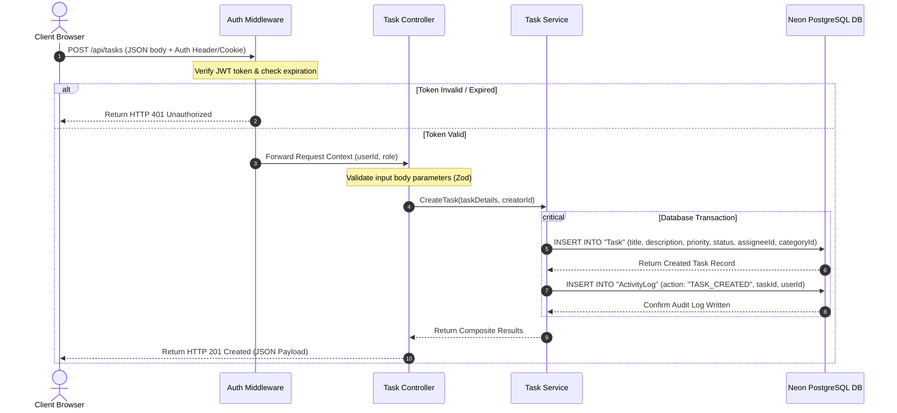

# 📐 System Design & Architecture
**Task Management Portal Technical Design Specification**

---

## 🏗️ 1. Architecture Overview

The **Task Management Portal** employs a modern full-stack web architecture optimized for reliability, clear separation of concerns, and security. The system is split into three core layers:
1.  **Presentation Layer**: A responsive React SPA client running inside the user's browser, communicating asynchronously via JSON HTTP REST APIs.
2.  **Application Logic Layer**: A stateless Node.js and Express.js API server handling business rules, request validation, security middlewares, and routing.
3.  **Data Persistence Layer**: A relational database (PostgreSQL hosted serverless on Neon) that stores structured application state with relational integrity, managed via Prisma ORM.

---

## 🗺️ 2. High-Level Component Topology

The system components are decoupled to ensure independent scalability and easier troubleshooting.

```mermaid
graph TB
    subgraph Client Application (Browser)
        ReactSPA["React.js SPA"]
        AxiosClient["Axios HTTP Client<br>(with Token Interceptors)"]
        StateContext["Auth & UI Context State"]
        
        ReactSPA <--> StateContext
        ReactSPA --> AxiosClient
    end

    subgraph API Gateways & Load Balancing
        Cloudflare["Cloudflare Edge Routing<br>(DNS, SSL, Basic DDoS)"]
    end

    subgraph Application Server (Render Node.js VM)
        ExpressApp["Express.js Server Engine"]
        Middlewares["Middleware Pipelines<br>(Rate-limit, CORS, Helmet, Auth Check)"]
        Controllers["Controllers<br>(Routing & Input Validation)"]
        Services["Service Domain Layer<br>(Core Logic & Auth Rules)"]
        PrismaORM["Prisma Database Client"]

        ExpressApp --> Middlewares
        Middlewares --> Controllers
        Controllers --> Services
        Services --> PrismaORM
    end

    subgraph Data Tier (Neon Serverless Postgres)
        DBConnectionPooler["Neon Connection Pooler<br>(PgBouncer)"]
        PostgresEngine["PostgreSQL Engine"]
        
        DBConnectionPooler --> PostgresEngine
    end

    %% Network & Request Routing Flows
    AxiosClient -->|HTTPS REST Request| Cloudflare
    Cloudflare -->|Forwarded API Request| ExpressApp
    PrismaORM -->|SQL Queries via TCP/IP| DBConnectionPooler
```

---

## 🔄 3. End-to-End Data & Execution Flows

### 3.1 User Authentication and Session Inception Flow
This sequence shows the path of a credential registration and login handshake verifying a session.



### 3.2 Task Creation and Audit Trail Execution Flow
This diagram details the sequence when an authorized user initiates the creation of a new project task.



---

## 🧱 4. Key Architectural Decisions

### 4.1 Serverless Relational Database (Neon PostgreSQL) vs. NoSQL (MongoDB)
*   **Decision**: Select Neon serverless PostgreSQL instead of NoSQL databases.
*   **Rationale**: Task management systems are inherently relational (Users own Tasks, Tasks belong to Categories, Activities link to both Users and Tasks). Enforcing strict foreign keys at the engine layer ensures data integrity, which is harder to maintain in schema-less document databases.

### 4.2 Stateless API (JWT in Cookies) vs. Stateful Sessions (Redis/Express-Session)
*   **Decision**: Utilize JSON Web Tokens containing authorization scopes, stored within secure `httpOnly`, `secure`, and `samesite=strict` cookies.
*   **Rationale**: Decouples the API server from database session lookups on every single incoming request, facilitating scale-out application hosting.

### 4.3 Unified DB Client (Prisma ORM) vs. Raw SQL (pg-pool)
*   **Decision**: Utilize Prisma ORM for client persistence.
*   **Rationale**: Autogenerated typescript/javascript types synced with migrations minimize runtime serialization issues, providing compile-time assurance that database queries conform to the schema model.

---

## 🔗 Internal Guide Directory

For detailed implementations of individual system components shown above:
*   **API Interface Specifications**: [docs/api-documentation.md](file:///c:/Resume%20Project/Task%20Management%20Portal/docs/api-documentation.md)
*   **Database Schema & Prisma Modeling**: [docs/database-design.md](file:///c:/Resume%20Project/Task%20Management%20Portal/docs/database-design.md)
*   **Directory Structures & Architecture Guide**: [docs/architecture-guide.md](file:///c:/Resume%20Project/Task%20Management%20Portal/docs/architecture-guide.md)
*   **Security & Guard Pipelines**: [docs/security-auth.md](file:///c:/Resume%20Project/Task%20Management%20Portal/docs/security-auth.md)
